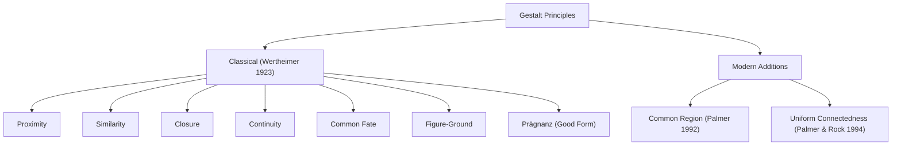

# Gestalt Principles of Perception

The human visual system does not see a collection of pixels — it sees structure. Before any conscious analysis begins, your brain has already organized the visual field into groups, layers, and figures. The Gestalt principles describe the rules governing this automatic organization. For interface designers, these principles are not abstract theory — they are the mechanics by which users perceive (or fail to perceive) the relationships between elements on screen.

## The Principle

In 1923, Max Wertheimer published "Untersuchungen zur Lehre von der Gestalt" (Laws of Organization in Perceptual Forms), systematizing observations that he and his colleagues Kurt Koffka and Wolfgang Köhler had been developing since 1912. The core thesis was the Gestalt motto: **the whole is different from the sum of its parts.** Perceptual organization is not derived from individual elements but emerges from the relationships between them.

Wertheimer identified several grouping laws, which have been extended by subsequent researchers. The major principles are:

### Proximity

Elements that are close together are perceived as a group. Proximity is the strongest static grouping cue and overrides similarity when the two conflict. In a grid of dots, reducing the horizontal spacing between columns while increasing the vertical spacing between rows causes users to see vertical columns rather than horizontal rows — even if row elements share the same color.

### Similarity

Elements that share a visual property — color, shape, size, orientation — are perceived as belonging together. Similarity is the second most powerful grouping cue. In a list of items, making one item a different color immediately separates it from the group perceptually, even if its spatial position is identical.

### Closure

The visual system completes incomplete shapes. A circle with a gap is still perceived as a circle, not as an arc. This principle enables minimal icon design — a few lines suggesting a familiar form are sufficient because the brain fills in the rest. Closure is why outline icons work: users perceive the enclosed region as a shape even when the boundary is not fully drawn.

### Continuity

Elements arranged along a smooth path are perceived as a group. A line that curves through a set of points creates a perceived connection, even if the points belong to different data categories. Continuity guides reading flow — left-to-right for Western text, top-to-bottom for vertical layouts. Alignment exploits continuity: elements sharing a left edge appear related because the eye follows the implicit line.

### Common Fate

Elements that move in the same direction at the same speed are grouped together. This is a dynamic grouping cue — it only applies when there is motion. In UI, common fate explains why items that animate together (e.g., a sidebar sliding in with all its children) are perceived as a single unit, while an element that moves independently is perceived as separate.

### Figure-Ground

The visual system spontaneously segregates the visual field into a **figure** (the object of attention) and **ground** (the background). The figure appears to be in front, has a defined shape, and is more memorable. The ground is perceived as continuing behind the figure and is shapeless. In UI, modals exploit figure-ground: the modal dialog is the figure, and the dimmed page behind it is the ground. Drop shadows and elevation reinforce figure-ground separation.

### Prägnanz (Law of Good Form)

Also called the law of simplicity: ambiguous stimuli are perceived in the simplest, most regular, most symmetric way possible. Given a pattern that could be interpreted as either two overlapping rectangles or an irregular octagon, people see two rectangles. This principle is why clean, geometric layouts feel "right" — they match the visual system's preference for regularity.

### Palmer's Additions

**Common region (Palmer, 1992):** Elements enclosed within the same bounded area are grouped together, even when proximity and similarity suggest different groupings. A box around a set of controls groups them more effectively than proximity alone. Card-based designs exploit common region — each card's border creates a grouping boundary.

**Uniform connectedness (Palmer & Rock, 1994):** Elements connected by a visual link (a line, a shared background color, a shared border) are perceived as a unit. This is often the most powerful grouping cue of all. Connecting two items with a line groups them more strongly than proximity, similarity, or common region.

## Design Implications

- **Group related controls with proximity.** Place related buttons, inputs, and labels close together and separate unrelated groups with whitespace. This is the single most effective grouping tool and costs nothing.
- **Use similarity for shared function.** All primary action buttons should share the same color and shape. All destructive actions should share a different color. Similarity signals "these things do the same kind of thing."
- **Leverage closure for minimal icons.** You do not need a fully closed shape for users to recognize it. Minimalist icons that suggest a form through partial boundaries are often cleaner and more legible at small sizes than fully detailed ones.
- **Exploit continuity for reading flow.** Align form labels and inputs along a single vertical edge to create a line of continuity. Multi-step wizards should use a horizontal progress bar that exploits continuity to convey sequence.
- **Use figure-ground deliberately for layering.** Modals, popovers, and dropdown menus should have clear figure-ground separation via shadow, contrast, and/or backdrop dimming. If figure and ground are ambiguous, users become confused about what is interactive.

## The Evidence

Wertheimer's foundational contribution actually began in 1912 with the study of **apparent motion** (the phi phenomenon). He showed two lights flashing in alternation and demonstrated that, at the right timing interval (~60ms), observers perceived a single light moving between the two positions — not two lights flashing. This was the spark for Gestalt psychology: the perceived motion was an emergent property that existed nowhere in the physical stimulus.

In his systematic 1923 paper, Wertheimer presented dot patterns and line arrangements designed to isolate individual grouping laws. For proximity, he showed rows of equally spaced dots, then introduced unequal spacing and documented how grouping shifted. For similarity, he alternated colors within a row and showed that participants reported seeing columns of same-colored dots. Each principle was demonstrated with multiple configurations and the paper established the phenomenological method — relying on observers' spontaneous reports of what they "see" — as the standard approach for grouping research.

Stephen Palmer's 1992 study of **common region** was methodologically important because it demonstrated a new grouping principle that Wertheimer had not described. Palmer presented displays where proximity predicted one grouping but enclosure (common region) predicted another. Participants consistently grouped by common region, even when proximity cues were strong and in the opposing direction. This showed that common region is an independent, powerful grouping cue — not reducible to proximity or similarity.

Deep Dive: Methodology & Replications

The early Gestalt work (Wertheimer 1923, Koffka 1935) used <strong>phenomenological demonstrations</strong> — showing participants a stimulus and asking them to describe what they saw. This method is subjective and was criticized by behaviorists, but it remains effective for grouping research because grouping percepts are typically immediate and unambiguous. Modern studies supplement phenomenological reports with reaction time and accuracy measures.

<strong>Palmer (1992)</strong> used a more rigorous approach. He created displays where grouping cues were placed in opposition — for example, proximity predicted grouping into pairs AB-CD, but common region (boxes) predicted grouping into pairs BC-DE. Participants performed a speeded grouping judgment task, and both accuracy and reaction time were recorded. Common region won consistently, with near-ceiling accuracy and fast RTs, demonstrating that it is not merely a "tiebreaker" but a primary cue.

<strong>Palmer & Rock (1994)</strong> used the same opposition methodology to test uniform connectedness. They found that connecting two elements with a line grouped them more strongly than proximity, similarity, or common region. They proposed that uniform connectedness might be the most fundamental grouping cue — the one from which others derive.

<strong>Quantitative approaches:</strong>

<ul>
<li>Kubovy & Wagemans (1995) developed the <strong>dot lattice</strong> paradigm, where a grid of dots can be grouped in multiple orientations depending on relative spacing. By systematically varying the spacing ratios, they derived quantitative psychometric functions for the strength of proximity-based grouping — the first precise measurement of a Gestalt law.</li>
<li>Claessens & Wagemans (2008) extended the dot lattice paradigm to similarity, measuring how color similarity and proximity interact quantitatively.</li>
</ul>

## Related Studies

**Palmer & Rock (1994)** — Proposed uniform connectedness as a new grouping principle and argued it may be more fundamental than Wertheimer's original laws. Connected elements are grouped even when proximity, similarity, and common region all predict a different organization. This work has major implications for node-link diagrams, flowcharts, and any UI that uses lines to show relationships.

**Todorovic (2008)** — Published a comprehensive modern review of Gestalt grouping principles, including quantitative measurements and computational models. Todorovic argued that the principles are best understood as probabilistic tendencies, not absolute rules, and proposed a Bayesian framework where grouping reflects the most probable scene interpretation.

**Wagemans et al. (2012)** — A major centennial review paper in *Psychological Bulletin* that traced the evolution of Gestalt principles from Wertheimer's 1912 work through 100 years of research. Identified open questions, including how principles interact when they conflict, individual differences in grouping, and the neural mechanisms underlying perceptual organization.

Deep Dive: Extended Literature

<strong>Rock & Palmer (1990)</strong> wrote an influential <em>Scientific American</em> article titled "The Legacy of Gestalt Psychology" that brought Gestalt principles back into mainstream cognitive science after decades of neglect during the cognitive revolution. They argued that Gestalt grouping is a form of unconscious inference about scene structure — connecting to Helmholtz's 19th-century theory of perception.

<strong>Quinlan & Wilton (1998)</strong> studied how multiple grouping principles combine when they agree or conflict. When proximity and similarity agree, grouping is fast and strong. When they conflict, there is a measurable cost in reaction time, and proximity typically dominates — but the relative strength depends on the magnitude of each cue.

<strong>Peterson & Skow (2008)</strong> investigated how figure-ground assignment interacts with object recognition. They showed that familiar shapes (e.g., a standing person's silhouette) are more likely to be seen as figure than ground, demonstrating that figure-ground assignment is not purely bottom-up but influenced by stored knowledge. This has implications for icon design — familiar shapes are "seen" more readily as figures.

<strong>Johnson (2014)</strong> in <em>Designing with the Mind in Mind</em> provided the most thorough mapping of Gestalt principles to UI design patterns. He demonstrated how proximity failures cause form layout confusion, how similarity violations make navigation inconsistent, and how poor figure-ground separation causes modal dismissal errors. The book includes before/after redesigns illustrating each principle.

## See Also

- [Preattentive Processing](../lessons/02-preattentive-processing.md) — preattentive features interact with Gestalt grouping; similar elements are grouped before attention is engaged
- [Design Principles](../lessons/12-design-principles.md) — Gestalt principles underpin many of Norman's design heuristics

## Try It

Exercise: Redesign a Poorly Grouped Toolbar

A graphics editor has a horizontal toolbar with 12 buttons in a single row, equally spaced: Pencil, Brush, Eraser, Line, Rectangle, Ellipse, Fill, Eyedropper, Zoom In, Zoom Out, Undo, Redo.

Users report that they frequently click Eraser when they meant to click Line, and they can never quickly find Undo. Diagnose the problem using Gestalt principles and propose a redesign.

<strong>Diagnosis:</strong>

<ul>
<li><strong>Proximity failure:</strong> All 12 buttons are equally spaced, so no subgroups are perceived. The toolbar is one undifferentiated row, forcing serial scanning.</li>
<li><strong>Similarity failure:</strong> All buttons have the same size, shape, and background. There is no visual distinction between drawing tools, modification tools, view tools, and edit tools.</li>
<li><strong>Continuity problem:</strong> The equal spacing creates continuity across the entire row, preventing natural "chunk" boundaries.</li>
</ul>

<strong>Redesign using Gestalt principles:</strong>

<ul>
<li><strong>Proximity:</strong> Insert 16px gaps between logical groups: [Pencil, Brush, Eraser] — [Line, Rectangle, Ellipse] — [Fill, Eyedropper] — [Zoom In, Zoom Out] — [Undo, Redo]. The gaps break the row into five perceptual groups.</li>
<li><strong>Common region:</strong> Add subtle background boxes or divider lines between groups to reinforce the proximity cues.</li>
<li><strong>Similarity:</strong> Give each group a slightly different icon style or tint (e.g., drawing tools in blue-gray, view tools in green-gray) to reinforce grouping by function.</li>
<li><strong>Figure-ground:</strong> Make the Undo/Redo group slightly larger or positioned at the far right edge with extra spacing, exploiting the serial position effect combined with proximity separation.</li>
</ul>

<strong>Predicted outcome:</strong> Users will perceive five tool groups instead of one row. Eraser and Line will no longer be confused because they are in different perceptual groups. Undo will be found faster because its group is spatially distinct and at a predictable position (far right).

