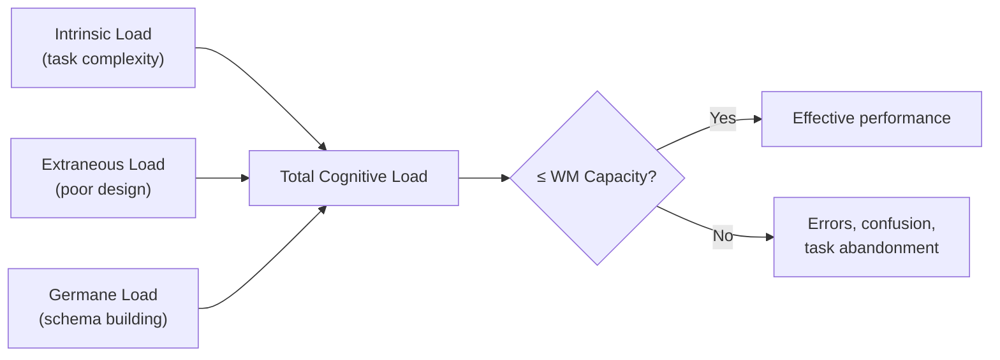

# Cognitive Load Theory

Cognitive load theory explains why some interfaces feel effortless and others feel exhausting — even when they present the same information. The theory, developed by John Sweller in the late 1980s, identifies three distinct sources of mental demand and provides a principled framework for reducing unnecessary burden. If working memory is a small container, cognitive load theory tells you what to pour in, what to leave out, and how to organize what remains.

## The Principle

Sweller's (1988) cognitive load theory begins with a simple premise: working memory has a fixed capacity, and all learning and task performance must pass through that bottleneck. The total cognitive load at any moment is the sum of three types:

$$\text{Total Load} = \text{Intrinsic} + \text{Extraneous} + \text{Germane}$$

- **Intrinsic load** comes from the inherent complexity of the task itself — the number of interacting elements a person must hold in mind simultaneously. Filing a tax return has high intrinsic load because income, deductions, and credits interact. Clicking "like" on a post has low intrinsic load.

- **Extraneous load** comes from poor design. It is any mental effort that does not contribute to understanding or completing the task. Scanning back and forth between a diagram and its legend on a separate page is extraneous load. Deciphering an ambiguous icon is extraneous load. This is the load designers can and should eliminate.

- **Germane load** is the productive mental effort devoted to building schemas and integrating new information into long-term memory. When a user works through a well-designed tutorial and forms a mental model of the system, that effort is germane.

The critical constraint is that total load must not exceed working memory capacity:

$$\text{Intrinsic} + \text{Extraneous} + \text{Germane} \leq \text{WM Capacity}$$

When it does, learning stops and task performance collapses. Because intrinsic load is determined by the task, the designer's job is to **minimize extraneous load** so that as much capacity as possible is available for germane processing.

Several well-documented effects follow from this framework:

**Split-attention effect.** When users must mentally integrate two or more sources of information that are physically separated — such as a diagram on one page and its explanatory text on another — extraneous load spikes. Integrating them into a single display (labels on the diagram) eliminates this cost.

**Redundancy effect.** Presenting the same information in multiple formats (narration that merely reads on-screen text) adds load rather than helping, because the user must cross-reference two channels to confirm they match.

**Modality effect.** Working memory has partly independent channels for verbal and visual information (Baddeley's phonological loop and visuospatial sketchpad). Presenting visual information alongside spoken narration uses both channels, effectively increasing available capacity compared to presenting everything visually.

## Design Implications

- **Reduce extraneous load by placing labels near their targets.** Form labels should be directly above or beside the field, not in a separate column. Error messages should appear next to the offending field, not in a banner at the top of the page. This eliminates the split-attention cost of mapping messages to fields.
- **Avoid redundancy.** If an icon already communicates meaning, adding a tooltip that says the same thing is harmless. But reading aloud on-screen text in a tutorial video is detrimental — use narration to explain the visual, not repeat it.
- **Exploit the modality effect.** When teaching a complex procedure, combine visual demonstration (video, diagram) with spoken explanation rather than visual demonstration with on-screen text. This distributes load across subsystems.
- **Manage intrinsic load through scaffolding.** If the task is inherently complex, break it into steps. A tax filing wizard that handles one section at a time reduces element interactivity — the number of things the user must consider simultaneously — at each step.
- **Place error messages adjacent to the relevant field.** A form that displays "3 errors found" in a red banner at the top forces the user to hold those errors in working memory while scrolling to locate the problematic fields. Inline validation eliminates this cross-referencing.

## The Evidence

The most direct evidence for the split-attention effect comes from **Sweller and Chandler (1994)**. In a series of experiments, they gave participants instructional materials on electrical engineering. In the *split-source* condition, a circuit diagram and its explanatory text were on separate pages; in the *integrated* condition, the text was embedded as labels directly on the diagram. Participants in the integrated condition performed significantly better on subsequent transfer tests and reported lower mental effort ratings. The effect was large and consistent across multiple replications.

Richard Mayer extended cognitive load theory into multimedia learning. In **Mayer (2001)**, published as *Multimedia Learning* (Cambridge University Press), he documented a suite of principles derived from controlled experiments:

- **Spatial contiguity principle:** Students learned better when corresponding text and graphics were placed near each other (d = 1.12 across 22 tests).
- **Temporal contiguity principle:** Animation and narration presented simultaneously produced better learning than sequentially (d = 1.30).
- **Modality principle:** Animation + narration outperformed animation + on-screen text (d = 1.17).
- **Redundancy principle:** Animation + narration outperformed animation + narration + on-screen text (d = 0.72) — adding the text *hurt* because it was redundant.

These effect sizes are remarkably large for educational research and have been replicated many times, making Mayer's principles some of the most robust findings in instructional design.

Deep Dive: Methodology & Replications

Sweller and Chandler's (1994) experiments used a between-subjects design. Participants (typically undergraduate engineering students) were randomly assigned to either the split-source or integrated condition. They studied the materials for a fixed time, then completed a written test requiring them to explain, predict, or troubleshoot circuit behavior. The dependent measures were <strong>test score</strong> and <strong>subjective mental effort</strong> (rated on a 9-point Likert scale). The integrated group consistently scored higher and reported lower effort. The researchers also measured <strong>study time</strong> to reach a performance criterion and found the integrated group needed less time.

Mayer's methodology was similar in spirit but applied to multimedia. A typical experiment compared two groups watching a short animation about how lightning forms. One group heard narration while viewing the animation; the other read on-screen text. Both groups then took a <strong>retention test</strong> (recall the steps) and a <strong>transfer test</strong> (answer novel problem-solving questions). Transfer test performance was the critical outcome because it measures deep understanding, not just surface memorization.

Mayer's effect sizes were computed as Cohen's d across multiple replications. The modality effect (narration > on-screen text, d = 1.17) was replicated in 17 of 17 experiments across five research groups. The redundancy effect (narration alone > narration + on-screen text, d = 0.72) was replicated in 5 of 5 experiments. These replications span different content domains (meteorology, botany, engineering) and participant populations (college students, military trainees), strengthening the generalizability claim.

One important boundary condition: Kalyuga et al. (2003) documented the <strong>expertise reversal effect</strong>, showing that instructional techniques that reduce load for novices can actually <strong>increase</strong> load for experts. Integrated formats help novices because they cannot yet form their own integrations, but experts already have schemas that make the additional scaffolding redundant — and processing that redundancy costs effort. This means adaptive interfaces that adjust support level based on user expertise are theoretically optimal.

## Related Studies

**Kalyuga, Ayres, Chandler & Sweller (2003)** identified the expertise reversal effect: instructional designs optimized for novices (high scaffolding, integrated formats) become detrimental as learners gain expertise, because the scaffolding itself becomes redundant load. This implies that one-size-fits-all designs are suboptimal and that progressive complexity is important.

**Paas, Tuovinen, Tabbers & Van Gerven (2003)** developed the *cognitive load measurement* framework, combining subjective ratings (9-point effort scale), physiological measures (pupil dilation, heart rate variability), and performance metrics. Their work established that cognitive load is measurable and that subjective ratings correlate well (r ≈ 0.7–0.8) with objective indicators.

**Kirschner (2002)** applied cognitive load theory to collaborative learning and argued that distributing cognitive load across team members can be effective — but only when coordination costs do not offset the benefits. In HCI terms, this is relevant to collaborative tools: features that help teams divide complex tasks are valuable, but communication overhead is itself a form of extraneous load.

Deep Dive: Extended Literature

<strong>Worked example effect:</strong> Sweller and Cooper (1985) showed that studying worked examples is more effective for novices than solving equivalent problems, because problem-solving imposes heavy extraneous load (searching the problem space) that worked examples eliminate. In UI terms, showing a completed template or example before asking the user to create from scratch is an application of this effect.

<strong>Seductive details effect:</strong> Harp and Mayer (1998) found that adding interesting but irrelevant illustrations or anecdotes to instructional material actually <strong>decreased</strong> learning. The "seductive details" consumed working memory resources that could have been devoted to germane processing. For interface design, this warns against decorative animations, mascots, or entertaining copy that distracts from the task.

<strong>Signaling principle:</strong> Mautone and Mayer (2001) demonstrated that adding signals — headings, bold text, arrows pointing to key diagram elements — improved learning from multimedia by guiding attention and reducing the search component of extraneous load. This directly supports the use of visual hierarchy, progressive disclosure, and inline cues in interface design.

<strong>Application to form design:</strong> Wroblewski (2008) in <em>Web Form Design</em> compiled usability research showing that top-aligned labels (directly above fields) were faster to complete than left-aligned labels (requiring a horizontal saccade to map label to field). This is a direct manifestation of the split-attention effect: reducing the spatial distance between label and input reduces the extraneous cost of integration.

## See Also

- [Working Memory Limits](../lessons/04-working-memory.md) — cognitive load theory is built on the capacity limits established by Miller and Cowan
- [Mental Models & the Action Cycle](../lessons/06-mental-models.md) — germane load is the effort spent building and refining the user's mental model

## Try It

Exercise: Redesign a Split-Attention Form

Consider a form with the following layout:

<strong>Original design:</strong> A registration form places all field labels in a left sidebar, all input fields in a center column, and all validation error messages in a right sidebar. The user must visually scan across three columns to connect a label to its field to its error.

<strong>Task:</strong> Redesign this form to minimize extraneous cognitive load.

<strong>Worked solution:</strong>

<ul>
<li><strong>Integrate labels:</strong> Move each label directly above its input field (top-aligned). This eliminates the horizontal saccade between the label column and the field column.</li>
<li><strong>Inline errors:</strong> Place each error message directly below the offending field, in red text, appearing immediately on blur (not on submit). This eliminates the need to hold error information in working memory while searching for the field.</li>
<li><strong>Chunk fields:</strong> Group related fields (e.g., "Account Info" — email, password; "Personal Info" — name, phone) under section headings. Each section becomes a chunk of 2–3 fields.</li>
<li><strong>Progressive disclosure:</strong> If the form has optional fields (e.g., company name, department), hide them behind a "Show additional fields" link. This reduces the initial field count and intrinsic load for users who don't need those fields.</li>
</ul>

The redesigned form has the same fields but a dramatically lower extraneous load. The split-attention effect is eliminated, chunking reduces apparent complexity, and progressive disclosure keeps the initial view within working memory limits.

