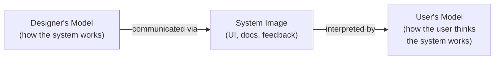
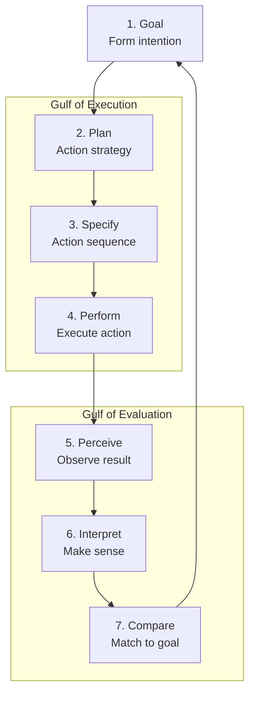

# Mental Models & the Action Cycle

Users do not interact with your system as it actually works — they interact with a simplified story of how they *believe* it works. This internal story is their mental model, and every frustration, every "I thought it would do X," traces back to a mismatch between what the user expects and what the system delivers. Donald Norman's action cycle provides a precise framework for identifying where these mismatches occur and how to close the gaps.

## The Principle

The concept of a mental model in HCI draws on a long lineage. Kenneth Craik (1943) proposed that humans carry "small-scale models" of reality in their heads, used to anticipate events and reason about causes. Philip Johnson-Laird (1983) formalized the idea in cognitive science, showing that people reason by constructing and manipulating internal models rather than applying formal logic.

Donald Norman (1983) applied the concept to design by distinguishing **three models**:

- **Designer's model** — the accurate, complete understanding the designer has of how the system actually functions.
- **System image** — everything the user can perceive: the interface, documentation, error messages, tooltips, behavior. This is the sole communication channel between designer and user.
- **User's model** — the simplified, often incomplete or incorrect representation the user constructs from interacting with the system image.

The designer never communicates directly with the user. The system image is the only medium. If the system image is ambiguous, the user's model will drift from the designer's model, and usability collapses.

Norman (1986) then introduced the **seven-stage action cycle**, a model of how people perform goal-directed tasks:

1. **Goal** — form an intention (e.g., "I want to save this document")
2. **Plan** — decide on a course of action
3. **Specify** — translate the plan into a specific action sequence
4. **Perform** — execute the actions on the interface
5. **Perceive** — observe what happened
6. **Interpret** — make sense of the observation
7. **Compare** — compare the outcome to the original goal

The cycle identifies two critical gaps:

- **Gulf of Execution** (stages 2–4): the distance between the user's intention and the actions the system allows. If the user wants to bold text but cannot figure out how, the gulf of execution is wide.
- **Gulf of Evaluation** (stages 5–7): the distance between the system's actual state and the user's ability to perceive and interpret it. If the user saved a file but received no visual confirmation, the gulf of evaluation is wide.

**Direct manipulation** — coined by Shneiderman (1983) and analyzed by Hutchins, Hollan & Norman (1985) — bridges both gulfs by making objects visible and actions reversible. Dragging a file to the trash can is direct manipulation: the gulf of execution is narrow (the action maps to the intention), and the gulf of evaluation is narrow (the file visibly disappears).

## Design Implications

- **Make the system image match the designer's model.** Expose the relevant internal state. If a process is running in the background, show a progress indicator. If a filter is active, display it prominently. Users cannot build correct mental models from invisible state.
- **Provide visibility of system state.** This is Norman's most fundamental principle. Users should always be able to answer: "What mode am I in? What just happened? What can I do next?"
- **Use familiar metaphors.** A shopping cart, a folder, a desktop — metaphors work because they import an existing mental model from the physical world, giving the user a running start. But metaphors break down at the edges (you cannot "weigh" a digital shopping cart), so complement them with explicit feedback.
- **Prefer direct manipulation over indirect commands.** Resizing a photo by dragging its corner is direct; typing a pixel value into a dialog box is indirect. Direct manipulation narrows both gulfs simultaneously.
- **Provide clear feedback after every action.** Feedback closes the gulf of evaluation. A button should change state when clicked. A form should confirm submission. A delete action should show what was removed and offer undo.

## The Evidence

The theoretical foundation was laid in Norman's chapter in *User Centered System Design* (Norman & Draper, 1986), where the seven-stage model first appeared in full form. Norman argued that most usability problems could be classified as either execution failures (the user cannot figure out what to do) or evaluation failures (the user cannot figure out what happened). The framework was descriptive rather than experimental, but it organized decades of empirical findings into a coherent theory.

The strongest empirical support for direct manipulation as a solution to both gulfs came from **Hutchins, Hollan & Norman (1985)**, published in *Human-Computer Interaction*. They analyzed why direct manipulation interfaces (such as Shneiderman's early spreadsheet and graphics tools) felt more usable. Their key insight was the concept of **cognitive directness**: in a direct manipulation interface, the user's intentions map nearly one-to-one onto available actions (reducing the gulf of execution), and the system's state is continuously visible as physical representations (reducing the gulf of evaluation). They contrasted this with command-line interfaces, where the user must translate intentions into arbitrary syntax (wide gulf of execution) and parse text output to assess results (wide gulf of evaluation).

Hutchins et al. also noted the paradox of direct manipulation: the more direct the interface feels, the more the user feels they are acting on the *objects themselves* rather than on *representations*. This sense of engagement — later called "flow" in other contexts — is a hallmark of well-designed interactive systems.

Deep Dive: Methodology & Replications

Norman's three-model framework and seven-stage action cycle are primarily <strong>analytical tools</strong> rather than empirically tested predictions. Norman himself described them as "approximate" models useful for design reasoning. However, the framework has been validated indirectly through decades of think-aloud usability studies.

A think-aloud study asks participants to verbalize their thoughts while performing a task. When analyzed through the action cycle lens, verbal protocols reliably reveal gulf-of-execution failures ("I don't know where to click") and gulf-of-evaluation failures ("Did it save? I can't tell"). Boren and Ramey (2000) reviewed 100+ think-aloud studies and found that the most commonly identified usability problems were interpretable as execution or evaluation gaps, supporting the descriptive adequacy of Norman's model.

Hutchins, Hollan & Norman (1985) used <strong>cognitive analysis</strong> rather than controlled experiments. They compared task models for the same operation (e.g., moving a file) across direct manipulation (drag) and command-line (type <code>mv source dest</code>) interfaces. For each stage of the action cycle, they assessed the <strong>articulatory distance</strong> (how closely the physical action resembles the user's intention) and <strong>semantic distance</strong> (how closely the system's representation maps to the user's domain concepts). Direct manipulation scored lower on both distances at every stage.

Shneiderman (1983) provided the original empirical motivation by observing that users of the VisiCalc spreadsheet — one of the first commercial direct manipulation interfaces — learned faster and made fewer errors than users of comparable command-based systems. Though the comparison was informal, it catalyzed a research program that produced more rigorous evidence through the 1980s and 1990s.

## Related Studies

**Gentner & Stevens (1983)** edited *Mental Models*, a landmark collection showing that people's mental models are often incomplete, unstable, and full of superstitions — users may believe that holding the mouse more firmly makes the cursor more precise, for instance. This implies that designers cannot rely on users building correct models spontaneously; the system image must actively guide model formation.

**Carroll & Olson (1988)** studied how users form mental models of text editors and found that users who received a clear conceptual model (an explicit explanation of how the system worked) outperformed those who received only procedural instructions (step-by-step commands). This supports the idea that investing in conceptual explanations — onboarding tours, "how it works" sections — pays off in long-term usability.

**Staggers & Norcio (1993)** published a comprehensive review of mental models in HCI, synthesizing 40 studies. They concluded that the strength of a user's mental model predicts task performance, error recovery, and transfer to new tasks, with effect sizes in the medium-to-large range across studies.

Deep Dive: Extended Literature

<strong>Norman's "Design of Everyday Things" (1988):</strong> Norman expanded the three-model framework and the action cycle into a full design philosophy in this influential book (originally titled <em>The Psychology of Everyday Things</em>). He introduced the concepts of <strong>affordances</strong> (what actions an object invites), <strong>signifiers</strong> (cues that indicate where to act), <strong>constraints</strong> (limits on possible actions), and <strong>mappings</strong> (the relationship between controls and their effects). Each concept maps to narrowing one of the two gulfs.

<strong>Distributed cognition:</strong> Hutchins (1995) extended the mental model concept beyond the individual in <em>Cognition in the Wild</em>, showing that complex systems (like a ship's navigation team) distribute cognitive work across people and artifacts. In HCI, this perspective motivates the design of collaborative interfaces where the system serves as a shared external representation — a common mental model materialized in the interface.

<strong>Conceptual models in modern design:</strong> Johnson and Henderson (2002) argued that every software product should have an explicit <strong>conceptual model</strong> document — a description of the objects, relationships, and actions the user encounters — and that this model should be designed before the interface. Their methodology has been adopted by companies including Apple, whose Human Interface Guidelines are organized around conceptual models (windows, views, controls).

<strong>Breakdowns and repair:</strong> Winograd and Flores (1986) introduced the concept of <strong>breakdowns</strong> — moments when the user's transparent engagement with the tool is disrupted and the tool itself becomes the focus of attention. A well-designed system minimizes breakdowns; when they occur, it provides clear pathways for repair (undo, clear error messages, help). Breakdowns map directly to wide gulfs of evaluation in Norman's framework.

## See Also

- [Working Memory Limits](../lessons/04-working-memory.md) — the user's mental model must fit within working memory constraints during active use
- [Design Principles](../lessons/12-design-principles.md) — Norman's design principles (affordances, signifiers, constraints, mapping, feedback) operationalize the action cycle
- [Feedback & Response Time](../lessons/15-feedback-response-time.md) — feedback is the primary mechanism for closing the gulf of evaluation

## Try It

Exercise: Map the Gulfs in a Real Interface

Pick a task you recently struggled with in any application (e.g., scheduling a recurring meeting, exporting a report, configuring a notification).

<strong>Step 1:</strong> Write down your <strong>goal</strong> (stage 1) in one sentence.

<strong>Step 2:</strong> Walk through stages 2–4 (Plan, Specify, Perform). Where did you get stuck? Could you not find the right menu (planning failure)? Did you find the menu but not know which option to pick (specification failure)? Did the button not respond as expected (performance failure)? This is the <strong>gulf of execution</strong>.

<strong>Step 3:</strong> Walk through stages 5–7 (Perceive, Interpret, Compare). After you acted, could you tell what happened? Did the system give feedback? Could you tell if your goal was achieved? This is the <strong>gulf of evaluation</strong>.

<strong>Step 4:</strong> Propose one design change to narrow each gulf.

<strong>Worked example:</strong> Goal: "Set a Slack reminder for tomorrow at 9am." Gulf of execution: the user knows <code>/remind</code> exists but cannot remember the exact syntax — <code>/remind me tomorrow at 9am "text"</code> or <code>/remind me "text" tomorrow at 9am</code>? The command interface has a wide gulf of execution because it requires recall of syntax. A form-based reminder (date picker + text field) would narrow this gulf. Gulf of evaluation: after typing the command, Slack responds with a confirmation message including the scheduled time — the gulf of evaluation is narrow. Design change for execution: add an autocomplete overlay that shows the expected syntax as the user types.

