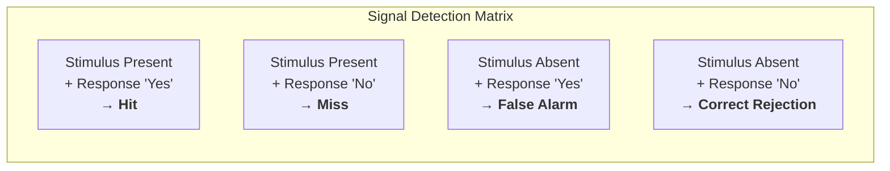

# Recognition over Recall

When you see a friend's face, you know them instantly — that is recognition. When you try to remember their phone number without looking it up, you struggle — that is recall. Recognition is fast, robust, and nearly effortless; recall is slow, fragile, and error-prone. Interfaces that rely on recognition instead of recall are dramatically easier to use because they align with the way human memory actually works.

## The Principle

Recognition and recall are two fundamentally different retrieval processes. In **recall**, the user must generate information from memory with minimal cues: "Type the command to list files." In **recognition**, the user sees a cue and determines whether they have encountered it before: "Is `ls` the command you want? Click it."

The difference in performance is enormous. Recall requires a self-initiated search through long-term memory, reconstructing the target from partial traces. Recognition requires only a **familiarity judgment** — comparing a presented stimulus against stored memories to detect a match. The match-detection process is faster and more reliable because the cue itself reactivates the memory trace.

**Signal detection theory** formalizes recognition performance. When a user encounters a stimulus (a menu item, an icon, a search result), they must decide: "Have I seen this before?" or "Is this what I'm looking for?" The decision produces four possible outcomes:

| | Response: "Yes, this is it" | Response: "No, this is not it" |
|---|---|---|
| **Target present** | Hit | Miss |
| **Target absent** | False Alarm | Correct Rejection |

In interface terms: when a user scans a menu for "Export," a hit is correctly selecting "Export," a miss is overlooking it, a false alarm is clicking "Extract" by mistake, and a correct rejection is correctly skipping "Extract." Good interface design maximizes hits and correct rejections by making targets visually distinct and non-targets clearly different.

**Encoding specificity** (Tulving & Thomson, 1973) adds another dimension: memory retrieval is most effective when the cues present at retrieval match the cues present at encoding. A user who learned a feature through a toolbar icon will recognize that icon faster than a text menu label, even if both refer to the same function. Consistency of cues across the interface matters because it preserves encoding specificity.

## Design Implications

- **Menus are better than command lines for novices.** A menu presents all available options — the user merely recognizes the one they want. A command line requires recalling the exact command from memory. Command lines are powerful for experts who have committed commands to long-term memory, but the initial learning burden is high.
- **Autocomplete bridges recall and recognition.** The user begins to recall (typing a few characters) and the system converts the task into recognition (presenting matching suggestions). This is why autocomplete dramatically reduces errors and speeds up input.
- **Show recent items, favorites, and history.** "Recently opened files" turns a recall task ("What was that file called?") into a recognition task ("Ah, there it is"). Breadcrumbs do the same for navigation.
- **Show options rather than requiring typed input.** Dropdowns, date pickers, and color palettes all replace recall with recognition. A date picker eliminates the need to recall the correct date format (MM/DD/YYYY vs. DD/MM/YYYY).
- **Icons with labels outperform icons alone.** An icon provides a visual cue; a label provides a verbal cue. Together, they activate two encoding pathways, making recognition faster and more accurate. Icons alone force a recall task: "What does this icon mean?"

## The Evidence

The most striking demonstration of recognition superiority comes from **Roger Shepard (1967)**. He showed participants **612 pictures** — photographs, drawings, and other images — one at a time. After viewing the full set, participants were given a two-alternative forced-choice recognition test: they saw the original image paired with a novel image and had to pick the one they had seen before. Recognition accuracy was **99.7%** — essentially perfect memory for hundreds of images, after a single viewing.

Shepard then tested verbal materials (sentences, words) using the same paradigm. Recognition accuracy was lower — around 88–90% — but still far above what recall paradigms would predict. The comparison demonstrates that visual recognition is particularly powerful, but recognition in general vastly outperforms recall.

**Lionel Standing (1973)** pushed the finding to its limit. He showed participants **10,000 pictures** over five days and tested recognition afterward. Accuracy was approximately **83%** — participants correctly recognized more than 8,000 images they had seen once. Standing estimated that if the images were more vivid or distinctive, recognition could be even higher. The sheer scale of visual recognition memory is staggering and has no parallel in recall performance.

These results imply that interfaces presenting visual options — icons, thumbnails, previews — tap into a recognition system with enormous capacity, while text-heavy interfaces requiring the user to remember names or codes impose the far more limited recall system.

Deep Dive: Methodology & Replications

Shepard (1967) used a <strong>two-alternative forced-choice (2AFC)</strong> paradigm, which is the gold standard for measuring recognition sensitivity without response bias. In a 2AFC test, the participant sees two items — one old (previously studied) and one new — and must pick the old one. Because chance performance is 50%, the 99.7% accuracy is far above chance, yielding a d' (sensitivity measure from signal detection theory) well above 4.0.

The 612 stimuli were deliberately varied: color photographs, line drawings, and some text. Shepard controlled for response bias by randomizing which side (left or right) the old item appeared on. The study time per image was approximately 6 seconds, with no instruction to memorize — just "look at each picture."

Standing (1973) replicated and extended Shepard's work using 10,000 photographs (from magazines) presented over five daily sessions. On the recognition test (2AFC with a 2-day delay), participants scored ~83%. Standing also tested a subset condition with 1,000 "vivid" images (unusual, emotional, or striking photographs) and found recognition accuracy of ~92%, suggesting that distinctiveness enhances the effect. He proposed a power-law relationship between study set size and recognition accuracy, predicting that recognition would remain above chance even for sets of a million items.

Critically, recall performance for the same materials would be dramatically lower. If asked to list the 612 pictures they had seen, participants might recall 20–50. This >10x gap between recognition and recall is one of the most robust findings in memory research and has been replicated across cultures (Kintsch 1970), age groups (Perlmutter and Mitchell 1982), and stimulus types (Brady et al. 2008 found high recognition for 2,500 objects even when targets and foils differed only in state or pose).

## Related Studies

**Tulving & Thomson (1973)** established the encoding specificity principle: a cue is effective for retrieval only if it was encoded with the target memory. In HCI terms, if a user learns a function through a particular icon, presenting a different icon (even one that is "objectively better") disrupts retrieval. Consistency of visual cues across versions of a product is therefore not merely aesthetic preference — it is a memory requirement.

**Mandler (1980)** proposed a dual-process theory of recognition: familiarity (a fast, automatic sense of "I've seen this before") and recollection (a slower, effortful retrieval of contextual details). Interface design benefits from both: familiar layouts reduce orientation time (familiarity), while distinctive elements help users remember where they found a specific feature (recollection).

**Lansdale (1988)** applied recognition and recall theory directly to filing and retrieval systems. He argued that traditional hierarchical file systems force a recall task (remembering the folder name and path), while search-based and tag-based systems convert this to recognition (scanning results). His work anticipated the shift from folder hierarchies to search-first paradigms like Gmail and Spotlight.

Deep Dive: Extended Literature

<strong>Brady, Konkle, Alvarez & Oliva (2008)</strong> demonstrated that visual recognition memory is not just large but also <strong>detailed</strong>. Participants studied 2,500 object images and were then tested with foils that were the same object in a different state (e.g., a closed vs. open laptop) or a different exemplar from the same category (a different laptop). Recognition accuracy remained above 87% even for these highly similar foils, showing that people store detailed visual representations, not just gist.

<strong>Nielsen (1994)</strong> directly measured the recognition vs. recall difference in an interface context. He had users perform tasks with a command-line interface (recall) and a menu-based interface (recognition). Menu users completed tasks 30% faster with 50% fewer errors, and the advantage was largest for infrequent tasks — exactly where recall is weakest. This directly validates the design implication that menus should be the default for non-expert users.

<strong>Wiedenbeck (1999)</strong> studied icon usability and found that <strong>labeled icons</strong> were recognized 30–40% faster than unlabeled icons in a visual search task, and that unlabeled abstract icons performed no better than random guessing for new users. The study strongly supports the practice of pairing icons with text labels, at least until the user has built sufficient familiarity.

<strong>Card sorting and information architecture:</strong> Spencer (2009) described how card sorting exploits recognition — participants sort labeled cards into groups by recognizing which items feel related, rather than recalling an organizational scheme from scratch. The technique reliably produces information architectures that match users' mental models because it leverages recognition-based categorization rather than designer-imposed recall structures.

## See Also

- [Working Memory Limits](../lessons/04-working-memory.md) — recognition offloads working memory because the cue is externally provided rather than internally generated
- [Heuristic Evaluation](../lessons/16-heuristic-evaluation.md) — Nielsen's "recognition rather than recall" is one of the 10 usability heuristics

## Try It

Exercise: Convert a Recall Interface to Recognition

Imagine a project management tool where users must type a project ID (e.g., "PRJ-2847") into a text field to assign a task to a project.

<strong>Task:</strong> Redesign the assignment flow to use recognition instead of recall.

<strong>Worked solution:</strong>

<ul>
<li><strong>Replace the text field with a searchable dropdown.</strong> As the user types, matching projects appear with their name and ID. The user recognizes the project name ("Website Redesign") rather than recalling the ID. This is an autocomplete pattern that bridges recall and recognition.</li>
<li><strong>Show recent projects.</strong> Below the dropdown, display the 3–5 most recently used projects. For repetitive workflows, the user simply recognizes and clicks — no typing at all.</li>
<li><strong>Add visual cues.</strong> Display a color-coded project icon beside each option. This adds a visual recognition channel (color + icon) to the verbal channel (project name), exploiting dual-coding for faster recognition.</li>
<li><strong>Display context.</strong> Show the project owner and a brief description in each dropdown option. This additional context activates encoding-specific cues — the user remembers "that was Sarah's project" even if they forget the exact name.</li>
</ul>

The original design required pure recall (memorize an arbitrary ID). The redesign converts each step into recognition: search suggestions, recent items, visual cues, and contextual details all serve as retrieval cues.

