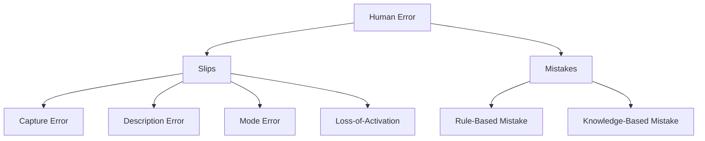

# Slips vs Mistakes

When a user deletes the wrong file or formats a drive they meant to keep, we instinctively call it "human error." But not all errors are alike. James Reason's taxonomy draws a fundamental line between slips — correct intention, wrong execution — and mistakes — wrong intention, correct execution. Distinguishing between them is essential because slips and mistakes have entirely different causes and demand entirely different design interventions.

## The Principle

Jens Rasmussen (1983) laid the groundwork with his **SRK framework**, which describes three levels of human cognitive control:

- **Skill-based** — automatic, routine behavior with minimal conscious attention (typing, driving a familiar route).
- **Rule-based** — applying learned rules to recognized situations ("if the warning light is amber, check the pressure gauge").
- **Knowledge-based** — conscious reasoning from first principles in novel situations ("I have never seen this error before; let me think through what could cause it").

Errors at each level have different characteristics. James Reason (1990) built on Rasmussen's framework to produce the most influential error taxonomy in HCI and safety engineering:

### Slips (Execution Failures)

The user has the **correct intention** but the action goes wrong during execution. Slips occur at the skill-based level — the user is operating on autopilot and something derails the automatic routine.

**Capture errors** — A more frequent or habitual action "captures" the intended action. You intend to drive to the grocery store but find yourself on the route to work because that route is more practiced.

**Description errors** — The intended action is performed on the wrong object because the correct and incorrect objects share a description. You pour orange juice into your coffee mug instead of the glass sitting right next to it — both are cylindrical containers on the counter.

**Mode errors** — The user performs an action appropriate for one mode while the system is in another. Typing a password into a chat window because you thought the focus was on the login field. Pressing "Reply All" when you meant "Reply."

**Loss-of-activation errors** — The user forgets the goal mid-sequence. You walk into a room and forget why you went there. In software: opening a new tab and forgetting what you were about to search for.

### Mistakes (Planning Failures)

The user has the **wrong intention** — they form an incorrect plan, then execute it correctly. The action itself is performed without error, but it was the wrong action to take.

**Rule-based mistakes** — The user applies a correct rule to the wrong situation, or applies an incorrect rule. A user sees "disk full" and deletes system files instead of clearing temp files — they applied the rule "delete files to free space" but chose the wrong target.

**Knowledge-based mistakes** — The user encounters a novel situation and reasons incorrectly from incomplete or wrong mental models. A user unfamiliar with version control runs `git push --force` to "fix" a merge conflict, overwriting their teammates' work.

### The Error Taxonomy

### The Swiss Cheese Model

Reason (1990) also proposed the **Swiss Cheese Model** of accident causation. Every layer of defense in a system has holes — like slices of Swiss cheese. An accident occurs when the holes in multiple layers align, allowing an error to pass through every defense. In a well-designed interface, even if a user commits a slip (layer 1), a confirmation dialog (layer 2), an undo mechanism (layer 3), and a backup system (layer 4) each have a chance to catch it. The design goal is not to eliminate errors — that is impossible — but to ensure that no single error can pass through all layers of defense uncaught.

## Design Implications

- **For capture errors:** make destructive actions look and feel different from routine ones. A "Delete Account" button should not resemble a "Save" button in position, size, or color.
- **For description errors:** make similar objects visually distinct. If two input fields are adjacent, label them prominently. Do not rely on position alone to differentiate them.
- **For mode errors:** always display the current mode prominently. If the system has modes (edit vs. view, insert vs. overwrite), the mode indicator must be impossible to miss. Better yet, eliminate modes where possible.
- **For loss-of-activation:** provide breadcrumbs, history, and "recently visited" features so users can reconstruct their intent. Auto-save protects against lost work when users forget to save.
- **For rule-based mistakes:** improve the system image so users form correct rules. Clear labeling, helpful defaults, and contextual guidance prevent the application of wrong rules.
- **For knowledge-based mistakes:** provide undo, clear error messages, and progressive disclosure. Users reasoning from first principles need a safety net because their reasoning may be flawed.

## The Evidence

Reason's foundational evidence came from **diary studies** conducted in the late 1970s. He asked participants to keep journals of their everyday errors — pressing the wrong button, going to the wrong room, saying the wrong word. Over several studies (Reason 1979, 1984), he collected thousands of error reports from hundreds of participants.

The diary data revealed several striking patterns. First, the vast majority of everyday errors were slips, not mistakes — people usually knew what they wanted to do but failed in execution. Second, capture errors were disproportionately common: the most-practiced action in a given context tended to "capture" less-practiced alternatives. Third, errors clustered around routine tasks performed under divided attention — precisely the skill-based level of Rasmussen's framework.

Reason (1990) formalized these observations in *Human Error*, extending the framework from everyday slips to industrial accidents. He analyzed major incidents — Three Mile Island, Chernobyl, the Challenger disaster — and showed that each involved chains of errors across multiple levels (slips, rule-based mistakes, and knowledge-based mistakes) passing through inadequate defenses. The Swiss Cheese Model emerged from this analysis.

Deep Dive: Methodology & Replications

The diary study method has known limitations. Self-report is biased toward errors that are noticed and memorable — slips that are immediately caught and corrected may be underreported, while dramatic or embarrassing errors may be overreported. There is no objective verification that the reported error actually occurred as described.

Despite these limitations, the diary method revealed patterns that proved robust across multiple investigators:

<ul>
<li><strong>Reason (1979)</strong> collected 433 error reports from 35 participants over a 2-week period. Capture errors accounted for the largest single category. He found that errors were more frequent during routine tasks performed under distraction.</li>
<li><strong>Norman (1981)</strong> independently collected similar error diaries and arrived at a compatible taxonomy (activations, descriptions, capture, mode errors), providing convergent validity.</li>
<li><strong>Sellen (1994)</strong> conducted an ecological study comparing error rates in different work contexts. She found that mode errors were significantly more common in software systems with hidden modes (no visible mode indicator) than in systems with prominent mode displays — directly supporting the design implication of visible mode indicators.</li>
</ul>

The Swiss Cheese Model has been extensively validated in safety-critical domains. <strong>Shappell & Wiegmann (2000)</strong> developed the Human Factors Analysis and Classification System (HFACS), based on Reason's model, and applied it to over 300 military aviation accidents. They found that the vast majority of accidents involved errors at multiple levels (preconditions, unsafe acts, supervisory failures, organizational influences), confirming the multi-layer defense model.

<strong>Perneger (2005)</strong> tested the Swiss Cheese Model quantitatively and found that while the metaphor is powerful, the independence assumption (that holes in different layers are uncorrelated) often does not hold. Systemic failures can create correlated holes across multiple layers — a management culture that discourages reporting errors can simultaneously weaken several defenses.

## Related Studies

**Norman (1983)** — "Design Rules Based on Analyses of Human Error" was one of the first papers to translate error classification directly into design guidelines. Norman proposed that designers should analyze the types of errors their systems are likely to produce and then choose design interventions matched to the error type — constraints for slips, better feedback for mistakes.

**Rasmussen (1983)** — "Skills, Rules, and Knowledge: Signals, Signs, and Symbols, and Other Distinctions in Human Performance Models" established the SRK framework that Reason later built upon. Rasmussen's contribution was showing that human performance operates at qualitatively different levels, each with its own error characteristics and intervention strategies.

**Senders & Moray (1991)** — *Human Error: Cause, Prediction, and Reduction* provided a comprehensive treatment of error from multiple theoretical perspectives, including signal detection theory, control theory, and Reason's cognitive framework. They argued that errors are a natural byproduct of adaptive cognitive mechanisms and cannot be eliminated, only managed.

**Hollnagel (1993)** — *Human Reliability Analysis: Context and Control* challenged the traditional view of errors as failures and instead framed them as variability in performance. Hollnagel's later work on "Safety-II" (2014) argued for studying what goes right, not just what goes wrong.

Deep Dive: Extended Literature

<strong>Byrne & Bovair (1997)</strong> conducted controlled experiments on mode errors in a simulated word processor. They found that users committed significantly more mode errors when the mode indicator was removed from the display, and that even experienced users were not immune. Error rates increased further under time pressure and divided attention, consistent with Reason's theory that slips increase when cognitive resources are depleted.

<strong>Gray (2004)</strong> — "The Soft Constraints Hypothesis" proposed that many slips result from microstrategic optimizations: users adopt the strategy that minimizes immediate effort, even when that strategy has a small probability of error. For example, users look away from the screen while typing (saving the effort of shifting gaze) and then discover a mode error. Gray tested this with the Blocks World task and showed that users traded accuracy for reduced interaction cost.

<strong>Back, Cheng, Dann, Curran & Toze (2006)</strong> studied "post-completion errors" — errors that occur after the main goal has been achieved (e.g., leaving your card in the ATM after withdrawing cash). They found that these are a specific type of loss-of-activation error and that design interventions forcing the user to complete the post-completion step (e.g., ATMs that return the card before dispensing cash) virtually eliminated them.

<strong>Li, Blandford, Cairns & Young (2008)</strong> extended Reason's taxonomy to interactive medical devices and showed that the slip/mistake distinction was predictive of error severity. Mistakes (wrong plan) tended to produce more severe consequences than slips (wrong execution) because slips are often caught quickly while mistakes may persist undetected until their consequences become visible.

## See Also

- [Design Principles](../lessons/12-design-principles.md) — Norman's principles are the primary tools for preventing both slips and mistakes
- [Error Prevention & Recovery](../lessons/14-error-prevention-recovery.md) — specific techniques for preventing and recovering from each error type
- [Mental Models](../lessons/06-mental-models.md) — knowledge-based mistakes stem from incorrect mental models of how the system works

## Try It

Exercise: Classify and Redesign

Consider the following scenario: A user is composing a long email. They press <code>Ctrl+W</code> intending to delete the last word, but the application interprets <code>Ctrl+W</code> as "close window." The email is lost.

<strong>Step 1 — Classify the error:</strong>

This is a <strong>mode error</strong> (a type of slip). The user had the correct intention (delete a word) but executed a keyboard shortcut that means different things in different applications. The user's mental model of the keyboard shortcut was based on one application (e.g., a terminal or word processor where <code>Ctrl+W</code> deletes a word), but the current application (e.g., a browser) interprets it as "close tab/window."

<strong>Step 2 — Apply the Swiss Cheese Model:</strong>

Layer 1 (Prevention): The shortcut mapping differs between applications — no defense here. Layer 2 (Detection): The application could detect unsaved content and prompt. Layer 3 (Recovery): Draft auto-save would preserve the content. Layer 4 (Mitigation): A "reopen closed tab" feature could restore the session.

<strong>Step 3 — Design interventions:</strong>

<ul>
<li><strong>Prevention:</strong> Allow users to customize keyboard shortcuts, or follow platform-consistent mappings.</li>
<li><strong>Detection:</strong> When closing a window with unsaved content, display a confirmation dialog: "You have unsaved changes. Close anyway?"</li>
<li><strong>Recovery:</strong> Auto-save drafts every 30 seconds. When the user reopens the application, offer to restore the draft.</li>
<li><strong>Mitigation:</strong> Provide <code>Ctrl+Shift+T</code> (reopen closed tab) with session state restoration.</li>
</ul>

A well-designed system implements all four layers. Any single layer might fail, but the chance of all four failing simultaneously is small.

