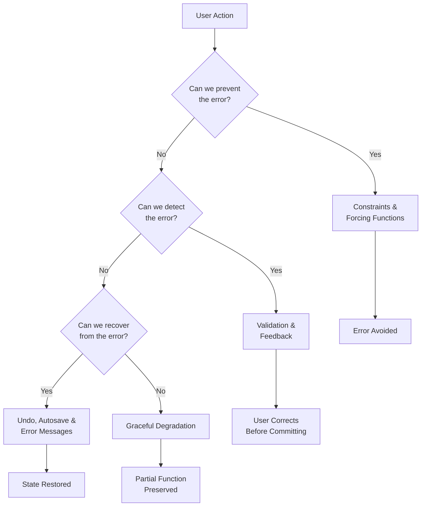

# Error Prevention & Recovery

Designing for errors is not an admission of failure — it is an acknowledgment of reality. Every interface will be used incorrectly, every workflow will encounter unexpected states, and every user will eventually press the wrong button. The question is not whether errors will occur, but whether your design prevents the avoidable ones and recovers gracefully from the rest. This lesson covers the full spectrum: prevention through constraints and forcing functions, detection through validation and feedback, and recovery through undo, autosave, and informative error messages.

## The Principle

Error management in interface design operates at three levels: **prevention**, **detection**, and **recovery**. The most effective interfaces layer all three.

### Prevention: Constraints and Forcing Functions

Norman (1988) identified four types of **constraints**:

- **Physical constraints** — the shape of the object prevents incorrect use. A USB-A plug only fits one way (mostly). A SIM card tray has a notch that prevents insertion in the wrong orientation.
- **Semantic constraints** — the meaning of the situation restricts possible actions. A rearview mirror only makes sense facing backward.
- **Cultural constraints** — conventions dictate behavior. Red means stop; green means go. The "X" button closes a window.
- **Logical constraints** — reasoning narrows the remaining options. If three of four screws are in place, the fourth must go in the remaining hole.

**Forcing functions** are a stronger form of constraint — they make it *impossible* to proceed without performing the correct action. Norman (1988) identified three types:

- **Interlocks** — operations must occur in the correct sequence. A microwave will not start with the door open. A car will not shift out of park without the brake pressed.
- **Lock-ins** — the system prevents the user from leaving a state prematurely. A "Save before closing?" dialog is a lock-in — it forces you to make a decision about unsaved work before closing.
- **Lockouts** — the system prevents the user from entering a dangerous state. A nuclear reactor control that requires two simultaneous key turns is a lockout.

Shigeo Shingo (1986) introduced the concept of **poka-yoke** (mistake-proofing) in manufacturing. A poka-yoke device makes it physically or procedurally impossible to make a specific error. In UI design, the equivalent is an input field that only accepts valid characters, a date picker that prevents selecting invalid dates, or a confirmation dialog that requires typing the resource name before deletion.

### Detection: Validation and Feedback

When prevention is not possible, the next line of defense is **detection** — catching errors before they take effect:

- **Inline validation** — check each field as the user fills it, not after they press submit. Show errors next to the relevant field with specific guidance.
- **Confirmation dialogs** — for irreversible or high-impact actions, ask the user to confirm. But use them sparingly: confirmation fatigue causes users to click "OK" without reading.
- **Warnings and previews** — show the user what will happen before it happens. A "you are about to send this email to 500 people" preview is more effective than a generic confirmation.

### Recovery: Undo, Autosave, and Error Messages

When an error occurs, recovery mechanisms determine whether the user loses seconds or hours:

**Undo/Redo** — Shneiderman (1983) established undo as a fundamental interaction principle. Single-level undo reverses the last action. Multi-level undo (Ctrl+Z repeatedly) lets users step back through a history. Modern applications support branching undo trees and selective undo.

**Autosave and checkpoints** — The shift from manual save to autosave (popularized by Google Docs) eliminated an entire category of data-loss errors. Autosave at regular intervals, plus manual checkpoints for named versions, provides comprehensive protection.

**Informative error messages** — A good error message answers three questions:
1. **WHAT** happened? ("Your payment could not be processed.")
2. **WHY** did it happen? ("The card number you entered is invalid.")
3. **HOW** can the user fix it? ("Please check the number and try again, or use a different card.")

Most error messages fail at least one of these. "Error 500: Internal Server Error" answers none. "An unexpected error occurred" answers the first vaguely and the other two not at all.

**Graceful degradation** — When full recovery is not possible, preserve as much functionality as possible. If the image server is down, show text content. If the payment system fails, save the cart for later. If offline, queue actions for when connectivity returns.

**Escape hatches** — Every state should have a way out. Every modal should have a close button. Every wizard should have a back button. Every process should be cancelable. Users who feel trapped become anxious users.

## Design Implications

- **Every destructive action needs confirmation OR undo — ideally both.** Gmail's "undo send" (a brief delay before actual transmission) is a masterclass in error recovery.
- **Autosave is strictly superior to manual save.** Users should never lose more than a few seconds of work. Save state continuously and let users name checkpoints for version management.
- **Error messages must be specific.** Replace "Invalid input" with "Email address must contain an @ symbol." Replace "Error" with "Could not connect to server — check your internet connection."
- **Disable invalid actions rather than allowing them and showing errors.** A grayed-out "Submit" button that activates when the form is valid prevents the error entirely.
- **Always provide back and cancel.** No dialog or wizard should be a one-way street. The user must always be able to reverse course without penalty.
- **Design for partial failure.** Network requests fail. Services go down. Disk space runs out. Design each component to degrade independently rather than cascading into a total failure.

## The Evidence

Lewis & Norman (1986) provided one of the first systematic treatments of error in interface design in their chapter "Designing for Error." They argued that the traditional approach — blaming the user — is a design failure. If many users make the same error, the fault lies in the design, not the users. They proposed a design-centered approach: analyze likely errors, classify them by type (slip vs. mistake), and apply type-appropriate interventions.

Shneiderman (1983) introduced the concept of **direct manipulation** interfaces and argued that undo was essential to their success. He reasoned that interfaces encouraging exploration (try something, see what happens) must provide a safety net — otherwise users become paralyzed by the fear of irreversible consequences. His "eight golden rules of interface design" included "permit easy reversal of actions" as rule five.

Nielsen (1994), in formulating his ten usability heuristics, dedicated heuristic #5 to "error prevention" (design to prevent errors before they occur) and heuristic #9 to "help users recognize, diagnose, and recover from errors" (error messages in plain language, suggesting solutions). His heuristic evaluations of dozens of systems showed that error-related usability problems were among the most frequent and most severe.

Deep Dive: Methodology & Replications

<strong>Lewis & Norman (1986)</strong> used case-study analysis — examining specific interface designs and cataloging the errors they produced. Their methodology was observational rather than experimental, but their contribution was conceptual: establishing that error prevention and recovery should be explicit design goals, not afterthoughts.

<strong>Shneiderman (1983)</strong> argued from first principles and observational evidence. He did not conduct controlled experiments on undo specifically, but the adoption of undo across all major software platforms in the following decade served as a massive natural experiment. Applications that lacked undo were consistently rated lower in usability studies.

<strong>Nielsen (1994)</strong> developed his heuristics through factor analysis of 249 usability problems identified across multiple evaluations. He found that a compact set of heuristics could capture the vast majority of usability issues. Error prevention and recovery heuristics accounted for approximately 15-20% of all identified problems — making them among the most impactful categories.

<strong>Maxion & de Champeaux (1995)</strong> conducted controlled experiments comparing constrained interfaces (where invalid actions were prevented) against unconstrained interfaces (where invalid actions were permitted and then flagged). They found that constrained interfaces reduced errors by 50-80% and reduced task completion time by 20-30%. Users also reported significantly higher satisfaction with constrained designs, contradicting the intuition that constraints feel restrictive.

<strong>Shingo's poka-yoke (1986)</strong> was validated primarily through manufacturing case studies at Toyota. Quality defect rates dropped by orders of magnitude when poka-yoke devices were installed. While the direct evidence is from physical manufacturing, the principle translates directly: design the interface so the error <em>cannot</em> occur, rather than detecting it after the fact.

## Related Studies

**Shingo (1986)** — *Zero Quality Control: Source Inspection and the Poka-Yoke System* introduced mistake-proofing as a manufacturing philosophy. Shingo argued that quality inspection after production is wasteful — the goal should be to prevent defects at the source. In UI design terms: validate at input time, not at submit time.

**Maxion & de Champeaux (1995)** — Demonstrated experimentally that constrained interfaces outperform unconstrained ones on error rate, task time, and user satisfaction. This provided empirical support for the design principle of disabling invalid actions rather than allowing and correcting them.

**Tognazzini (2014)** — In "First Principles of Interaction Design," Bruce Tognazzini articulated the principle that users should never lose work due to an error on their part or a failure on the system's part. He advocated for continuous autosave, unlimited undo, and crash recovery as baseline requirements for any modern application.

Deep Dive: Extended Literature

<strong>Akers, Simpson, Jeffries & Winograd (2009)</strong> studied undo usage patterns in a large-scale deployment of a collaborative editing tool. They found that 60% of undo operations occurred within 10 seconds of the original action, suggesting that most errors are caught quickly. However, 15% of undo operations occurred more than 5 minutes later, indicating the need for robust multi-level undo with persistent history.

<strong>Suh, Convertino, Chi & Pirolli (2016)</strong> studied the design of autosave systems and found that users who were aware of autosave explored more freely and reported lower anxiety. However, when autosave conflicts with manual save expectations, users can be confused about which version is current. The recommendation: make autosave behavior visible (e.g., "All changes saved") and provide explicit version history.

<strong>Nielsen Norman Group (2001)</strong> compiled guidelines for error message design based on analysis of hundreds of error messages across commercial software. They found that the most common failure was omitting the HOW component — telling users what went wrong without telling them how to fix it. Messages that included all three components (WHAT, WHY, HOW) reduced error-recovery time by an average of 50%.

<strong>Oulasvirta, Dayama, Shiripour, John & Karrenbauer (2020)</strong> used computational design optimization to generate interface layouts that minimize predicted error rates based on cognitive models. They showed that optimal layouts — which tend to separate destructive actions spatially and constrain input sequences — reduced predicted error rates by 30% compared to typical designer-created layouts.

## See Also

- [Slips & Mistakes](../lessons/13-slips-and-mistakes.md) — the error taxonomy that determines which prevention strategy to apply
- [Design Principles](../lessons/12-design-principles.md) — constraints, feedback, and visibility are the foundational principles behind error prevention
- [Feedback & Response Time](../lessons/15-feedback-response-time.md) — timely feedback is essential for error detection
- [Heuristic Evaluation](../lessons/16-heuristic-evaluation.md) — Nielsen's heuristics #5 and #9 directly address error prevention and recovery

## Try It

Exercise: Design a Three-Layer Error Defense

Scenario: You are designing a file management interface where users can permanently delete files. Design three layers of defense against accidental deletion.

<strong>Worked Example:</strong>

<strong>Layer 1 — Prevention (Constraints):</strong>

<ul>
<li>The "Delete" button is visually distinct — red text, separated from other actions, and positioned away from commonly-used buttons like "Open" and "Rename."</li>
<li>System files and protected folders cannot be selected for deletion (logical constraint).</li>
<li>Batch deletion of more than 10 files requires explicit confirmation with item count displayed.</li>
</ul>

<strong>Layer 2 — Detection (Soft Delete):</strong>

<ul>
<li>Deleted files go to a Trash/Recycle Bin rather than being permanently destroyed.</li>
<li>A toast notification appears: "3 files moved to Trash — <strong>Undo</strong>" with a 10-second undo window.</li>
<li>For permanent deletion (emptying trash), a confirmation dialog requires the user to type "DELETE" to confirm.</li>
</ul>

<strong>Layer 3 — Recovery (Backups):</strong>

<ul>
<li>Automatic daily backups retain deleted files for 30 days.</li>
<li>A "File History" feature lets users browse and restore previous versions of any file.</li>
<li>Even after permanent deletion, an admin-level recovery tool can restore from backup snapshots.</li>
</ul>

Notice how each layer is independent. If the user bypasses the visual separation (Layer 1), the Trash catches it (Layer 2). If they empty the Trash impulsively, the backup catches it (Layer 3). This is the Swiss Cheese Model in action — each layer has holes, but the holes are unlikely to align.

