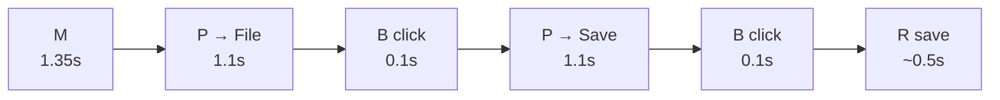

# Keystroke-Level Model

The Keystroke-Level Model (KLM) lets you predict how long an expert user will take to complete a routine task — without running a single user test. By decomposing any task into a sequence of physical and mental operators with known average durations, KLM gives designers a quantitative tool for comparing alternative designs on paper, before a line of code is written.

## The Principle

Stuart Card, Thomas Moran, and Allen Newell introduced the Keystroke-Level Model in 1980 as the simplest member of the GOMS family of human performance models. Their book *The Psychology of Human-Computer Interaction* (1983) formalized the full framework. The central premise is that expert, error-free task execution can be modeled as a serial sequence of elementary operators, and the total execution time is simply the sum of their durations:

$$T_{execute} = T_K + T_P + T_H + T_M + T_R + T_B$$

### The Six Operators

KLM defines six primitive operators:

| Operator | Description | Typical Duration |
|---|---|---|
| **K** | Keystroke or button press | ~0.28 s (average typist) |
| **P** | Point to a target (mouse move) | ~1.1 s (derived from Fitts's Law) |
| **H** | Home hands (move between keyboard and mouse) | ~0.4 s |
| **M** | Mental preparation (decide what to do next) | ~1.35 s |
| **R** | System response (wait for the computer) | variable |
| **B** | Mouse button press (click or release) | ~0.1 s |

The **K** operator varies with typing skill: 0.08 s for a fast typist (~135 WPM), 0.28 s for an average typist (~55 WPM), and 1.2 s for a hunt-and-peck typist. The **P** operator is derived from Fitts's Law and depends on the distance and size of the target, but 1.1 s is a reasonable default for typical GUI pointing tasks.

### Mental Operator Placement Rules

The trickiest part of KLM is deciding where to insert **M** operators. Card et al. provided heuristic placement rules:

- Place an **M** before every K that is not part of a cognitively chunked string (e.g., typing a known filename gets one M at the start, not one per keystroke).
- Place an **M** before every P that initiates a new cognitive unit (e.g., deciding which menu to click).
- Delete an **M** if the next action is a routine continuation of the current chunk (e.g., clicking "OK" after filling a known form).

### Example: Save via File Menu

Consider an expert user saving a document via the File menu:

$$T_{menu} = M + P + B + P + B + R = 1.35 + 1.1 + 0.1 + 1.1 + 0.1 + 0.5 = 4.25 \text{ s}$$

Now compare the keyboard shortcut Ctrl+S, assuming hands are already on the keyboard:

$$T_{shortcut} = M + K_{Ctrl} + K_S = 1.35 + 0.28 + 0.28 = 1.91 \text{ s}$$

The shortcut is **2.2x faster**, saving 2.34 seconds per invocation. For a task performed 50 times per day, that is nearly two minutes saved daily.

### The GOMS Hierarchy

KLM is the bottom layer of the broader **GOMS** framework:

- **Goals** — What the user wants to accomplish (e.g., "save the document").
- **Operators** — The atomic actions available (K, P, H, M, R, B in KLM).
- **Methods** — Sequences of operators that achieve a goal (e.g., File > Save vs. Ctrl+S).
- **Selection rules** — How the user chooses between alternative methods (e.g., "if I know the shortcut, use it; otherwise, use the menu").

More elaborate GOMS variants exist. **CMN-GOMS** (Card, Moran, Newell) adds hierarchical goal decomposition. **CPM-GOMS** (Cognitive-Perceptual-Motor) models parallel processing — the user can think about the next action while their hand is still moving — yielding tighter predictions for highly practiced tasks. **NGOMSL** (Natural GOMS Language) formalizes methods in a pseudo-programming notation.

## Design Implications

- **Compare designs without user testing.** KLM lets you calculate task completion times for two competing designs on paper. If Design A requires M+P+B+P+B and Design B requires M+K+K, you can quantify the savings before building either one.
- **Shortcuts save time by eliminating P and H operators.** Every keyboard shortcut that replaces a menu interaction removes at least one P (~1.1 s) and possibly an H (~0.4 s). This is why power users gravitate toward shortcuts.
- **Keyboard-only workflows eliminate H operators.** Every time the user switches between keyboard and mouse, an H (0.4 s) is incurred. Tab-based form navigation and keyboard-driven command palettes avoid this cost entirely.
- **Reduce M operators with clear affordances.** Each M costs 1.35 s — the most expensive operator after R. Designs that make the next action obvious (progressive disclosure, highlighted defaults, inline labels) reduce the number of M operators users need.
- **Use KLM to justify design decisions quantitatively.** Telling stakeholders "this redesign saves ~3 seconds per task" is more persuasive than "this feels faster." KLM provides the numbers.

## The Evidence

Card, Moran, and Newell (1980) validated KLM against empirical data from text editing tasks. They observed expert users performing a set of routine editing operations — inserting text, deleting words, moving paragraphs — in several text editors of the era (including BRAVO, a precursor to modern WYSIWYG editors). They then modeled each task using KLM operators and compared the predicted times to the observed times.

The results were remarkably good for such a simple model: KLM predictions were within **21%** of actual execution times across a range of tasks, with most predictions falling within 10-15%. The model was especially accurate for well-practiced, error-free tasks — exactly the use case it was designed for. For tasks involving search, exploration, or error recovery, predictions degraded because those behaviors involve cognitive processes that KLM's fixed M operator cannot capture.

The key insight was that expert performance on routine tasks is highly mechanical and predictable. Once a user has internalized a procedure, they execute it as a compiled sequence of motor and perceptual operations, with brief mental pauses only at decision points. KLM captures this compiled behavior.

Deep Dive: Methodology & Replications

Card et al.'s (1980) validation study used a controlled experimental design. Expert text editor users (at least 3 months of daily use) were given a standardized set of editing tasks: insert a word, delete a sentence, move a paragraph, and so on. Each task was filmed and timestamped to yield observed execution times. The experimenters then independently constructed KLM operator sequences for each task and summed the default operator durations.

Key methodological details:

<ul>
<li><strong>Error-free assumption:</strong> Only error-free task executions were included in the comparison. KLM does not model error detection and correction, so any trial with a mistake was excluded.</li>
<li><strong>Expert-only:</strong> Novice users were excluded because KLM assumes compiled, routine behavior. Novice performance involves exploration, reading, and deliberation that the fixed M operator cannot capture.</li>
<li><strong>Multiple editors:</strong> By validating across several different editors with different interaction paradigms (command-line, menu-driven, modeless), Card et al. demonstrated that KLM's accuracy was not tied to a specific interface style.</li>
<li><strong>Operator calibration:</strong> The default operator times (K=0.28s, P=1.1s, etc.) were measured empirically from separate calibration experiments, not fit to the task data, which makes the 21% accuracy genuinely predictive rather than circular.</li>
</ul>

Later, Kieras (1993) systematized the M-operator placement rules, reducing the subjectivity in the original formulation. His rules made KLM more teachable and reproducible, which increased its adoption in industry usability groups.

## Related Studies

**Kieras (2001)** provided a comprehensive tutorial on using GOMS and KLM for practical interface evaluation, with worked examples from telephone operator workstations and web form design. His chapter in the *Handbook of Human-Computer Interaction* remains the best practitioner-oriented reference for applying the model.

**John and Kieras (1996)** surveyed the GOMS family of models, comparing KLM, CMN-GOMS, CPM-GOMS, and NGOMSL on accuracy, effort required, and scope. They concluded that KLM is the best cost-benefit tradeoff for routine task comparison, while CPM-GOMS is needed when modeling tasks where perceptual, cognitive, and motor operations overlap in time.

**Gray, John, and Atwood (1993)** — Project Ernestine — is the most famous real-world application of GOMS. They modeled the task of telephone directory assistance operators switching from one workstation to another. The model predicted that the new workstation, despite appearing simpler, would actually be 0.63 seconds slower per call — a prediction confirmed by field data. Over millions of daily calls, this small difference translated into significant cost, and the deployment decision was reversed. Project Ernestine demonstrated that KLM-class models can influence major business decisions.

Deep Dive: Extended Literature

<strong>Gray et al. (1993)</strong> — Project Ernestine deserves elaboration. NYNEX (a regional phone company) planned to replace its operators' workstations with a new system that had fewer keys and a "simpler" interface. Gray's team built a CPM-GOMS model of both the old and new workflows. The model revealed that the new system, while having fewer buttons, required an additional eye fixation and a longer hand movement at a critical step — adding ~0.63 seconds per call. With 100 million calls per year, this amounted to thousands of additional operator hours. When field data confirmed the prediction, NYNEX reconsidered the deployment. This case study is the gold standard for demonstrating the business value of human performance modeling.

<strong>Holleis et al. (2007)</strong> adapted KLM for mobile touch devices, proposing additional operators for gestures such as swipe (S ~0.7s), pinch (X ~0.8s), and tap (replacing B with a slightly longer duration due to finger targeting). Their Mobile KLM found prediction accuracy comparable to the original KLM when applied to smartphone tasks.

<strong>Soukoreff and MacKenzie (1995)</strong> showed how to combine Fitts's Law more precisely with KLM by replacing the default P=1.1s with task-specific pointing times computed from actual target distances and widths. This refinement improved prediction accuracy for interfaces with highly variable target sizes (e.g., toolbars with mixed small and large icons).

<strong>Luo and John (2005)</strong> developed CogTool, a software tool that automates KLM analysis from interface mockups. Designers create a storyboard of screens, annotate the widgets, and CogTool generates the KLM operator sequence and predicts task time automatically. CogTool made KLM accessible to practitioners who did not want to learn the operator placement rules by hand.

## See Also

- [Fitts's Law](../lessons/10-fitts-law.md) — the P operator in KLM is derived directly from Fitts's Law, connecting pointing time to target distance and size
- [Feedback & Response Time](../lessons/15-feedback-response-time.md) — the R operator captures system response time, linking KLM to perceived performance
- [Hick's Law](../lessons/09-hicks-law.md) — Hick's Law governs the M operator duration when the user is choosing among alternatives

## Try It

Exercise: Compare Two Workflows with KLM

A user needs to bold a word in a text editor. Compare two methods:

<strong>Method A — Toolbar button:</strong> The user selects the word (already done), moves the mouse to the Bold button in the toolbar, and clicks it.

<strong>Method B — Keyboard shortcut:</strong> The user selects the word (already done), and presses Ctrl+B. Assume hands are on the keyboard.

<strong>Worked solution:</strong>

<strong>Method A (Toolbar):</strong>

<ul>
<li>M (decide to bold) = 1.35 s</li>
<li>P (move mouse to Bold button) = 1.1 s</li>
<li>B (click) = 0.1 s</li>
</ul>

$T_A = 1.35 + 1.1 + 0.1 = 2.55$ s

<strong>Method B (Shortcut):</strong>

<ul>
<li>M (decide to bold) = 1.35 s</li>
<li>K (Ctrl) = 0.28 s</li>
<li>K (B) = 0.28 s</li>
</ul>

$T_B = 1.35 + 0.28 + 0.28 = 1.91$ s

The shortcut is <strong>0.64 s faster</strong> (25% improvement), primarily by eliminating the P operator. If the user's hands were on the mouse (not the keyboard), Method B would also require an H operator: $T_B = 1.35 + 0.4 + 0.28 + 0.28 = 2.31$ s — still faster, but by a smaller margin.

Now try it yourself: model the task of "copy and paste a paragraph using Ctrl+C / Ctrl+V" versus "right-click > Copy, right-click > Paste." Which is faster, and by how much?

