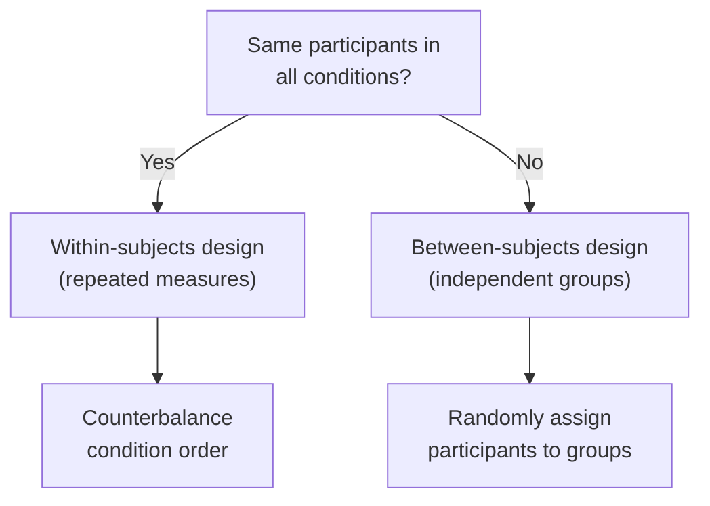

# Experimental Design for HCI

When a researcher asks "Is interface A better than interface B?", intuition and opinion are not enough. Experimental design is the systematic framework that lets us answer causal questions with confidence. It specifies what we manipulate, what we measure, how we assign participants, and how we guard against the dozens of biases that can silently corrupt our results. Without rigorous experimental design, a usability study is just an expensive anecdote.

## The Method

An experiment in HCI tests whether a change in one variable causes a change in another. The three categories of variables you must identify before running any study are:

- **Independent variable (IV):** The factor the experimenter deliberately manipulates. Examples: input technique (mouse vs. trackpad), font size (12pt vs. 16pt), menu layout (hierarchical vs. flat).
- **Dependent variable (DV):** The outcome being measured. Examples: task completion time, error rate, subjective satisfaction score.
- **Confounding variable:** Any factor that varies alongside the IV and could provide an alternative explanation for changes in the DV. If participants using Interface A are also more experienced than those using Interface B, experience is confounded with interface — and you cannot tell which caused the difference.

### Between-Subjects vs. Within-Subjects

The most fundamental design decision is how participants are assigned to conditions.

**Within-subjects (repeated measures):** Every participant experiences every condition. This is statistically powerful because individual differences are controlled — each person serves as their own baseline. The danger is **order effects**: practice, fatigue, or carryover from one condition can contaminate the next. Counterbalancing is mandatory.

**Between-subjects (independent groups):** Each participant experiences only one condition. There are no order effects, but you need more participants because between-person variability adds noise. Random assignment is critical to ensure groups are equivalent on average.

**Mixed/factorial designs** combine both. A study might use a between-subjects factor (novice vs. expert) crossed with a within-subjects factor (three input techniques). This lets you examine both main effects and interactions — for instance, whether experts and novices benefit differently from a particular technique.

### Counterbalancing

When running within-subjects designs, you must control the order in which participants encounter conditions. **Counterbalancing** systematically varies this order across participants.

For two conditions (A and B), half the participants do A-then-B and half do B-then-A. For three or more conditions, a **Latin square** ensures each condition appears in each ordinal position exactly once. A Latin square for three conditions (A, B, C) might be:

$$\begin{bmatrix} A & B & C \\ B & C & A \\ C & A & B \end{bmatrix}$$

Each row is one participant's order. With $k$ conditions you need at least $k$ participants (or a multiple of $k$) to complete the square. A **balanced Latin square** additionally ensures that each condition precedes every other condition equally often, which controls for first-order carryover effects.

### Factorial Designs

When you have two or more IVs, a factorial design crosses all levels of each IV. A $2 \times 3$ design has two levels of IV1 and three levels of IV2, producing six unique conditions. Factorial designs are efficient because they test multiple hypotheses simultaneously and reveal **interactions** — cases where the effect of one IV depends on the level of another.

## Worked Example

Paul Fitts's 1954 reciprocal tapping study is a masterclass in experimental design. Fitts asked participants to tap a stylus back and forth between two metal target plates as quickly and accurately as possible. The study aimed to quantify the relationship between target geometry and movement speed.

**Independent variables (within-subjects):**
- Target width $W$: four levels (0.25, 0.5, 1.0, 2.0 inches)
- Distance between targets $A$ (amplitude): four levels (2, 4, 8, 16 inches)

This produced a $4 \times 4$ factorial design with 16 conditions, all experienced by every participant.

**Dependent variable:** Movement time per tap (milliseconds), computed from the total time to complete a set of taps divided by the number of taps.

**Confound control:** Fitts counterbalanced the order of conditions across participants so that practice effects and fatigue were distributed evenly. The reciprocal tapping paradigm itself was clever: by having participants tap back and forth continuously, the task reached a steady-state rhythm, minimizing start/stop variability. Fitts also included practice trials before each condition block to reduce learning effects.

**Result:** Movement time was a linear function of the index of difficulty $ID = \log_2(2A/W)$, producing the foundational model now known as Fitts's Law:

$$MT = a + b \cdot \log_2\!\left(\frac{2A}{W}\right)$$

The design's strength was that every participant provided data for all 16 conditions, maximizing statistical power with a modest sample. Counterbalancing ensured that improvements from practice did not systematically favor easier or harder conditions.

Deep Dive: Full Statistical Analysis

<strong>Sample size justification:</strong> Fitts used 16 participants — a number that, not coincidentally, is a multiple of the 16 conditions, allowing a complete counterbalancing cycle. Modern power analysis (G*Power, with $\alpha = 0.05$, power $= 0.80$, and a large expected effect size $f = 0.40$ based on pilot data) would recommend approximately 12-15 participants for a within-subjects ANOVA with 16 conditions — Fitts's sample was appropriate.

<strong>Power analysis retrospective:</strong> Given that Fitts's Law typically explains $R^2 > 0.95$ of variance in movement time, the effect sizes are enormous by behavioral science standards. Cohen's $f$ for the main effect of $ID$ exceeds 2.0 in most replications, meaning the study was vastly overpowered for the primary hypothesis. However, the larger sample helped detect subtler effects like the slight deviations from linearity at extreme $ID$ values.

<strong>Effect size expectations:</strong> The linear regression of $MT$ on $ID$ yields $R^2$ values between 0.95 and 0.99 across studies. The slope $b$ (index of performance) is typically 100-200 ms/bit, meaning each additional bit of difficulty adds 100-200 ms of movement time. This is an extraordinarily strong and reliable effect — one of the most robust quantitative laws in all of psychology.

<strong>Learning control:</strong> Fitts addressed learning in two ways. First, participants completed several practice blocks before data collection began. Second, the counterbalanced order meant that any residual learning was orthogonal to the experimental conditions. Modern replications sometimes include block number as a covariate in the analysis to statistically remove practice trends.

<strong>Modern IRB requirements:</strong> Fitts's 1954 study predated institutional review boards (IRBs). Today, a replication would require informed consent, a protocol reviewed by an ethics board, debriefing, data privacy measures, and the right to withdraw without penalty. The physical risk of reciprocal tapping is minimal, so IRB review would likely be expedited, but the documentation overhead is substantial compared to Fitts's era.

## Common Pitfalls

- **Confounding variables with conditions.** If all participants use Interface A in the morning and Interface B in the afternoon, you cannot separate the effect of interface from the effect of time-of-day. Randomize or counterbalance assignment to break these associations.
- **Not counterbalancing within-subjects designs.** Order effects are not hypothetical — they are pervasive. Practice improves performance; fatigue degrades it. Without counterbalancing, your "best" condition might simply be whichever came last (or first).
- **Too few participants for between-subjects designs.** Within-subjects designs control individual differences automatically; between-subjects designs do not. A between-subjects comparison with 5 participants per group has very little power to detect anything but enormous effects. Run a power analysis before collecting data.
- **Testing significance without effect sizes.** A $p$-value tells you whether an effect is likely to be non-zero; it does not tell you whether the effect is large enough to matter. Always report an effect size measure (Cohen's $d$, $\eta^2$, or the raw mean difference with confidence interval).
- **Demand characteristics.** Participants who know the hypothesis may unconsciously (or consciously) behave in ways that confirm it. Use blinding where possible, and frame tasks neutrally.

Deep Dive: Extended Analysis

<strong>Asymmetric transfer (carryover):</strong> Even with counterbalancing, carryover effects can be asymmetric. Learning to use a gestural interface might permanently change how someone uses a traditional menu, but not vice versa. When you suspect asymmetric transfer, analyze the first condition each participant experienced (between-subjects comparison) as a check. If results differ from the within-subjects analysis, carryover is a concern.

<strong>ABBA counterbalancing vs. Latin squares:</strong> For two conditions, a simple ABBA pattern (A, B, B, A) within each participant can control linear trends (practice or fatigue). However, ABBA assumes the trend is linear and can fail if the trend is non-linear. Randomized counterbalancing (randomly assigning order) is more robust but requires more participants for balance.

<strong>Multiple comparisons:</strong> A factorial design with many conditions generates many pairwise comparisons. Testing all of them at $\alpha = 0.05$ inflates the family-wise error rate. Apply corrections: Bonferroni (conservative, divides $\alpha$ by number of comparisons), Holm-Bonferroni (less conservative, step-down procedure), or Tukey's HSD (designed for pairwise comparisons after ANOVA). In HCI, Bonferroni correction is the most commonly reported, though its conservatism can mask real effects.

<strong>Ecological validity vs. internal validity:</strong> Tightly controlled lab experiments maximize internal validity (confidence that the IV caused the DV) but may not generalize to real-world use. Field studies gain ecological validity but lose control over confounds. The best research programs use both: lab experiments to establish causal mechanisms, followed by field deployments to test generalizability. When designing an experiment, explicitly state what tradeoff you are making and why.

<strong>Pre-registration:</strong> Modern best practice is to pre-register your experimental design, hypotheses, and analysis plan before collecting data. Pre-registration prevents "researcher degrees of freedom" — the temptation to try multiple analyses and report only the one that yields significance. Platforms like AsPredicted and OSF Registries provide timestamped records of your plan.

## See Also

- [Data Collection & Metrics](../lessons/20-data-collection-metrics.md) — how to choose measures and statistical tests for your experiment
- [Fitts's Law](../lessons/10-fitts-law.md) — the study analyzed in the Worked Example, and one of HCI's most replicated experimental findings

## Try It

Exercise: Design a study comparing two text-entry methods on a smartwatch

A wearable-tech company has developed two text-entry methods for their smartwatch: (1) a tiny on-screen QWERTY keyboard and (2) a swipe-based gesture keyboard. They want to know which is faster and less error-prone for short messages (10-20 words). Design a rigorous experiment.

<strong>Step 1 — Identify variables:</strong>

<ul>
<li><strong>IV:</strong> Text-entry method (QWERTY vs. swipe) — 2 levels</li>
<li><strong>DV1:</strong> Task completion time (seconds to enter a standard phrase)</li>
<li><strong>DV2:</strong> Error rate (uncorrected errors per phrase, measured by string comparison)</li>
<li><strong>Potential confounds:</strong> Prior smartphone typing experience, hand size, phrase difficulty, learning effects</li>
</ul>

<strong>Step 2 — Choose design:</strong> Within-subjects is appropriate here. Both methods are novel on the watch form factor, so prior expertise is unlikely to create asymmetric transfer. Within-subjects halves the number of participants needed and controls for individual differences in motor skill.

<strong>Step 3 — Counterbalance:</strong> Half the participants start with QWERTY, half with swipe. Use the same set of phrases for both conditions, but randomize phrase order within each condition block.

<strong>Step 4 — Control confounds:</strong>

<ul>
<li>Include 5-minute practice blocks before each condition to reduce novelty effects</li>
<li>Use a standardized phrase set (e.g., MacKenzie &amp; Soukoreff's phrase set for text-entry evaluation)</li>
<li>Measure and report prior touchscreen typing experience as a covariate</li>
<li>Control watch position (dominant wrist, seated, table-supported)</li>
</ul>

<strong>Step 5 — Sample size:</strong> A power analysis for a paired t-test with $\alpha = 0.05$, power $= 0.80$, and an expected medium effect size ($d = 0.5$) requires approximately 34 participants. Round up to 36 for balanced counterbalancing.

<strong>Step 6 — Analysis plan:</strong> Paired t-tests for completion time and error rate. Report means, SDs, 95% confidence intervals, and Cohen's $d$. If distributions are non-normal (common for error rates), use Wilcoxon signed-rank test as a non-parametric alternative.

