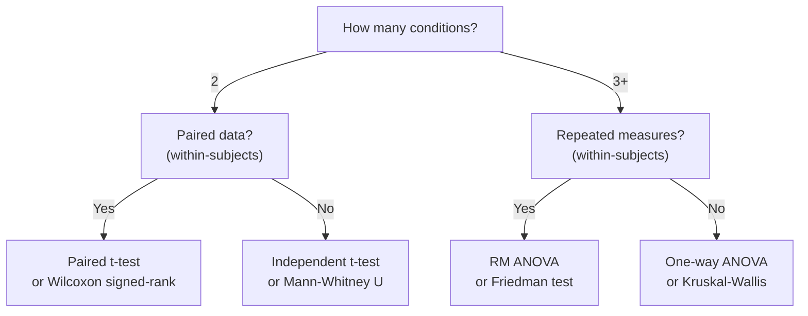

# Data Collection & Metrics

An experiment is only as good as what it measures and how it analyzes the measurements. Choosing the right metrics, collecting data cleanly, and applying appropriate statistical tests are what separate a publishable HCI study from a pile of spreadsheet data. This lesson covers the three pillars of HCI measurement — performance metrics, subjective questionnaires, and qualitative methods — then walks through the statistical machinery needed to draw valid conclusions.

## The Method

### Performance Metrics

Performance metrics are objective, behavioral measurements recorded during task execution.

- **Task completion time:** The most common DV in HCI experiments. Measured from task onset to successful completion. Report means and standard deviations; medians and IQRs if the distribution is skewed.
- **Error rate:** Proportion or count of incorrect actions. Distinguish between *corrected errors* (user noticed and fixed) and *uncorrected errors* (persisted in the final output). The two tell different stories — corrected errors reflect detection ability; uncorrected errors reflect the interface's failure to support error recovery.
- **Throughput (ISO 9241-9):** For pointing tasks, throughput combines speed and accuracy into a single metric measured in bits per second:

$$TP = \frac{ID_e}{MT}$$

where $ID_e = \log_2(D_e / W_e + 1)$ is the effective index of difficulty computed from the observed spread of endpoints ($W_e = 4.133 \times SD_x$) and the actual mean distance ($D_e$). Throughput is the gold standard for comparing pointing devices because it accounts for individual speed-accuracy tradeoffs.

### Subjective Questionnaires

Subjective measures capture the user's perceived experience — workload, satisfaction, usability — which objective measures may miss entirely.

**System Usability Scale (SUS)** (Brooke, 1996): A 10-item questionnaire scored on 5-point Likert scales. The scoring algorithm alternates positive and negative items:

$$SUS = 2.5 \times \sum_{i=1}^{10} s_i$$

where for odd-numbered items (positive), $s_i = \text{rating} - 1$, and for even-numbered items (negative), $s_i = 5 - \text{rating}$. The result ranges from 0 to 100. A score of 68 corresponds to the 50th percentile — it is the *average* score, not a threshold for "good." Scores above 80.3 fall in the top quartile (Grade A); scores below 51 indicate serious usability problems.

**NASA Task Load Index (NASA-TLX)** (Hart & Staveland, 1988): Measures perceived workload across six subscales: Mental Demand, Physical Demand, Temporal Demand, Performance, Effort, and Frustration. Each subscale is rated 0-100 (in increments of 5). The original "full TLX" includes a pairwise comparison weighting step; the widely used "Raw TLX" simply averages the six subscales. Raw TLX correlates highly with the weighted version ($r > 0.95$) and is far simpler to administer.

### Qualitative Methods

Qualitative data provides the *why* behind quantitative patterns.

**Think-aloud protocol** (Ericsson & Simon, 1993): Participants verbalize their thoughts while performing tasks. This reveals decision processes, confusion points, and mental models that no metric can capture. The trade-off: verbalizing can slow task performance and alter behavior (reactivity). **Concurrent** think-aloud happens during the task; **retrospective** think-aloud uses a video replay after the task, reducing reactivity but relying on memory.

**Observation and logging:** Interaction logs (clicks, scrolls, keystrokes, timestamps) provide granular behavioral data without disturbing the participant. Video recordings allow post-hoc coding of behaviors like hesitations, backtracking, and error recovery strategies.

### Statistical Tests

Choosing the correct test depends on two factors: the number of conditions and whether the design is within-subjects or between-subjects.

**Parametric tests** (t-test, ANOVA) assume approximately normal distributions and equal variances. **Non-parametric alternatives** (Wilcoxon, Mann-Whitney, Friedman, Kruskal-Wallis) make no distributional assumptions and are appropriate for ordinal data (Likert scales), small samples, or heavily skewed data.

### Effect Sizes

Statistical significance alone is insufficient. Effect sizes quantify *how large* a difference is.

**Cohen's $d$** for two-group comparisons:

$$d = \frac{\bar{x}_1 - \bar{x}_2}{s_p}$$

where $s_p$ is the pooled standard deviation. Benchmarks: $d = 0.2$ (small), $d = 0.5$ (medium), $d = 0.8$ (large).

**Eta-squared ($\eta^2$)** for ANOVA: the proportion of total variance explained by the factor. Benchmarks: $\eta^2 = 0.01$ (small), $\eta^2 = 0.06$ (medium), $\eta^2 = 0.14$ (large).

**Confidence intervals (CIs):** A 95% CI for a mean difference tells you the range within which the true difference likely falls. If the CI excludes zero, the difference is statistically significant at $\alpha = 0.05$. CIs are more informative than $p$-values because they communicate both the direction and the precision of the estimate.

## Worked Example

A research team compares two navigation designs for a mobile health app: a **tab bar** (Design A) and a **hamburger menu** (Design B). They recruit 24 participants in a within-subjects design, counterbalanced.

**Performance data (task completion time, seconds):**

| Measure | Tab Bar (A) | Hamburger (B) |
|---|---|---|
| Mean | 14.2 s | 18.7 s |
| SD | 3.8 s | 5.1 s |
| $n$ | 24 | 24 |

Mean difference: $\bar{d} = 18.7 - 14.2 = 4.5$ s. The standard deviation of the paired differences is $SD_d = 4.0$ s.

**Paired t-test:**

$$t = \frac{\bar{d}}{SD_d / \sqrt{n}} = \frac{4.5}{4.0 / \sqrt{24}} = \frac{4.5}{0.817} = 5.51$$

With $df = 23$, $p < 0.001$. The difference is statistically significant.

**Cohen's $d$ (paired):**

$$d = \frac{\bar{d}}{SD_d} = \frac{4.5}{4.0} = 1.13$$

This is a large effect. Participants were, on average, 4.5 seconds faster with the tab bar — a 24% reduction in task time.

**95% CI for the mean difference:** $4.5 \pm 2.069 \times 0.817 = [2.81, 6.19]$ s.

**SUS scores:** Tab bar mean = 78.5 ($SD = 11.2$), hamburger mean = 62.3 ($SD = 14.8$). The tab bar scores above average; the hamburger menu is below average (below the 50th percentile of 68).

**Interpretation:** Both the objective performance data and the subjective usability scores converge: the tab bar is faster, less error-prone, and perceived as more usable. The large effect size ($d = 1.13$) and the narrow confidence interval increase confidence that this difference is practically meaningful, not just statistically detectable.

Deep Dive: Full Statistical Output

<strong>Complete paired t-test output:</strong>

<ul>
<li>$t(23) = 5.51$, $p < 0.001$ (two-tailed)</li>
<li>Mean difference = 4.50 s</li>
<li>$SD$ of differences = 4.00 s</li>
<li>SE of differences = 0.817 s</li>
<li>95% CI: [2.81, 6.19]</li>
<li>Cohen's $d = 1.13$ (large)</li>
</ul>

<strong>SUS scoring algorithm step by step:</strong>

The SUS has 10 items, each rated 1-5. Items alternate between positively and negatively worded:

<ul>
<li><strong>Odd items (1, 3, 5, 7, 9):</strong> Positively worded. Contribution = rating $- 1$</li>
<li><strong>Even items (2, 4, 6, 8, 10):</strong> Negatively worded. Contribution = $5 -$ rating</li>
</ul>

Each item's contribution ranges from 0 to 4. Sum all 10 contributions (range 0-40), then multiply by 2.5 to scale to 0-100.

<strong>Example for one participant (Tab Bar):</strong>

Ratings: 4, 2, 5, 1, 4, 2, 4, 1, 5, 2

<ul>
<li>Odd contributions: $(4-1) + (5-1) + (4-1) + (4-1) + (5-1) = 3+4+3+3+4 = 17$</li>
<li>Even contributions: $(5-2) + (5-1) + (5-2) + (5-1) + (5-2) = 3+4+3+4+3 = 17$</li>
<li>Sum = 34, SUS = $34 \times 2.5 = 85$</li>
</ul>

<strong>Interpreting SUS scores with Sauro &amp; Lewis (2016) curved grading scale:</strong>

<ul>
<li>Grade A: $\geq 80.3$ (top 10%)</li>
<li>Grade B: 68.1 - 80.2</li>
<li>Grade C: 68 (literally the mean — 50th percentile)</li>
<li>Grade D: 51.0 - 67.9</li>
<li>Grade F: $\leq 51.0$ (bottom 15%)</li>
</ul>

<strong>When to use Wilcoxon signed-rank instead:</strong> If the Shapiro-Wilk test on the paired differences yields $p &lt; 0.05$, the normality assumption is violated. With $n = 24$, the paired t-test is fairly robust to non-normality (central limit theorem helps), but for safety — especially with Likert-scale data like SUS — the Wilcoxon signed-rank test is a defensible choice. In this example, the Wilcoxon test yields $W = 267$, $p &lt; 0.001$, confirming the parametric result. The matched-pairs rank-biserial correlation $r = 0.89$ (analogous to Cohen's $d$ for non-parametric tests) confirms a large effect.

<strong>NASA-TLX analysis:</strong> Raw TLX scores (average of 6 subscales): Tab bar mean = 32.4, Hamburger mean = 51.8. A paired t-test on Raw TLX: $t(23) = 4.87$, $p &lt; 0.001$, $d = 0.99$. The hamburger menu imposed substantially higher perceived workload, particularly on the Frustration subscale (Tab bar: 18.3, Hamburger: 42.1).

## Common Pitfalls

- **Treating $p < 0.05$ as the sole criterion.** A $p$-value is not the probability that the null hypothesis is true. It is the probability of data this extreme *given* the null hypothesis. With large samples, trivially small effects can reach $p < 0.05$. Always pair significance with effect sizes and confidence intervals.
- **Treating Likert data as interval without justification.** Individual Likert items (1-5 ratings) are ordinal, not interval — the distance between "Agree" and "Strongly Agree" may not equal the distance between "Neutral" and "Agree." Summed scales like SUS are more defensibly treated as interval, but single-item Likert comparisons should use non-parametric tests or be explicitly justified.
- **No multiple comparison correction.** If you compare 4 conditions pairwise, that is $\binom{4}{2} = 6$ comparisons. At $\alpha = 0.05$ each, the family-wise error rate is $1 - (1-0.05)^6 \approx 0.26$ — a 26% chance of at least one false positive. Apply Bonferroni, Holm, or Tukey corrections.
- **Confusing statistical significance with practical significance.** A 0.3-second difference in task completion time may be statistically significant with 200 participants but utterly meaningless in practice. Report effect sizes and discuss whether the magnitude matters for real users.
- **Misinterpreting SUS 68 as "good."** A SUS score of 68 is the 50th percentile — literally average. It means half of all tested systems score higher. A "good" score is above 80; an "excellent" score is above 85. Many practitioners mistakenly treat 68 as a passing grade.

Deep Dive: Extended Analysis

<strong>The Likert debate in detail:</strong> Carifio &amp; Perla (2008) argued that parametric tests on Likert data are robust and that the ordinal-vs-interval distinction is overstated in practice. Norman (2010) provided Monte Carlo simulations showing that t-tests and ANOVAs on 5-point Likert data yield accurate Type I error rates and adequate power, even with small samples and non-normal distributions. However, this applies to <em>summed scales</em> (multiple items), not individual items. For a single 5-point item with floor/ceiling effects, non-parametric tests remain safer.

<strong>Bayesian alternatives:</strong> Frequentist $p$-values answer "How surprising is this data if the null is true?" — but researchers usually want "How likely is the null given this data?" Bayesian analysis provides this via Bayes factors. A Bayes factor $BF_{10} = 15$ means the data are 15 times more likely under the alternative hypothesis than the null. JASP (free software) makes Bayesian paired t-tests and ANOVAs accessible. Bayesian methods also handle the multiple comparisons problem more naturally through hierarchical models.

<strong>Bootstrapped confidence intervals:</strong> When distributional assumptions are uncertain, bootstrapping provides non-parametric CIs. Resample the paired differences (with replacement) 10,000 times, compute the mean of each resample, and take the 2.5th and 97.5th percentiles as the 95% CI. Bootstrapped CIs make no normality assumption and are particularly useful for median comparisons or ratio metrics.

<strong>Reporting standards:</strong> The APA 7th edition requires: test statistic with degrees of freedom, exact $p$-value (not just "$p &lt; 0.05$"), effect size with CI, and descriptive statistics (means and SDs or medians and IQRs). Example: "Participants completed tasks significantly faster with the tab bar ($M = 14.2$ s, $SD = 3.8$) than the hamburger menu ($M = 18.7$ s, $SD = 5.1$), $t(23) = 5.51$, $p &lt; .001$, $d = 1.13$, 95% CI $[2.81, 6.19]$." Many HCI venues (CHI, UIST) follow APA reporting conventions.

<strong>Effect size heuristics — when Cohen's benchmarks mislead:</strong> Cohen himself cautioned that his small/medium/large labels were meant as starting points, not absolute standards. In HCI, a "small" Cohen's $d$ of 0.2 on task completion time might represent seconds saved per interaction — which compounds into hours over weeks of daily use. Always interpret effect sizes in the context of the task and the user population.

## See Also

- [Experimental Design](../lessons/19-experimental-design.md) — the design framework that determines which statistical tests are appropriate
- [Heuristic Evaluation](../lessons/16-heuristic-evaluation.md) — an inspection method that complements empirical data collection
- [Usability Testing](../lessons/18-usability-testing.md) — the practical context in which most of these metrics are collected

## Try It

Exercise: Analyze a two-condition usability study from raw data

You ran a within-subjects study comparing two search interfaces (Faceted vs. Keyword) with 20 participants. Here are the task completion times (seconds):

<strong>Faceted:</strong> 22, 18, 25, 20, 19, 23, 21, 17, 26, 24, 20, 22, 19, 21, 23, 18, 25, 20, 22, 19

<strong>Keyword:</strong> 28, 24, 30, 26, 25, 29, 27, 23, 32, 30, 26, 28, 25, 27, 29, 24, 31, 26, 28, 25

<strong>Step 1 — Compute descriptive statistics:</strong>

<ul>
<li>Faceted: $\bar{x} = 21.2$ s, $SD = 2.57$ s</li>
<li>Keyword: $\bar{x} = 27.15$ s, $SD = 2.62$ s</li>
<li>Mean of paired differences: $\bar{d} = 5.95$ s</li>
<li>$SD$ of paired differences: $SD_d \approx 1.10$ s</li>
</ul>

<strong>Step 2 — Select the test:</strong> Two conditions, within-subjects, continuous data. Use a paired t-test (or Wilcoxon if normality is violated).

<strong>Step 3 — Compute the test statistic:</strong>

$$t = \frac{\bar{d}}{SD_d / \sqrt{n}} = \frac{5.95}{1.10 / \sqrt{20}} = \frac{5.95}{0.246} = 24.19$$

With $df = 19$, $p \ll 0.001$.

<strong>Step 4 — Compute effect size:</strong>

$$d = \frac{\bar{d}}{SD_d} = \frac{5.95}{1.10} = 5.41$$

This is an extremely large effect — the faceted search interface produces dramatically faster task completion.

<strong>Step 5 — Confidence interval:</strong>

$5.95 \pm 2.093 \times 0.246 = [5.44, 6.47]$ s

<strong>Step 6 — Report:</strong> "Participants completed search tasks significantly faster with faceted search ($M = 21.2$ s, $SD = 2.57$) than keyword search ($M = 27.15$ s, $SD = 2.62$), $t(19) = 24.19$, $p &lt; .001$, $d = 5.41$, 95% CI $[5.44, 6.47]$."

