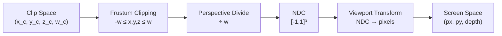

# Clipping & Normalized Device Coordinates

The vertex shader outputs a 4D vector called `gl_Position` in **clip space**. Between the vertex shader and the fragment shader, the GPU performs several critical steps: clipping primitives against the view frustum, dividing by $w$ to produce **Normalized Device Coordinates (NDC)**, and mapping NDC to actual screen pixels via the **viewport transform**. These steps are largely automatic, but understanding them is essential for debugging rendering artifacts, implementing custom clipping, and working with depth.

## Clip Space: The Vertex Shader's Output

Every vertex shader ends by writing to `gl_Position`:

```glsl
#version 330 core
layout (location = 0) in vec3 aPos;

uniform mat4 MVP; // projection * view * model

void main()
{
    gl_Position = MVP * vec4(aPos, 1.0);
    // gl_Position is now in clip space: (x_c, y_c, z_c, w_c)
}
```

Clip space is a 4D homogeneous coordinate system. The values are **not yet divided by $w$** — that happens later. The $w$ component carries the information needed for perspective correction.

For perspective projection, $w_c = -z_{\text{view}}$ (the negated view-space depth). For orthographic projection, $w_c = 1$.

## Clip Conditions

A point is inside the visible volume if and only if all six of these inequalities hold:

$$-w_c \leq x_c \leq w_c$$

$$-w_c \leq y_c \leq w_c$$

$$-w_c \leq z_c \leq w_c$$

This defines a region in 4D homogeneous space. After the perspective divide, these become the NDC bounds $[-1, 1]$ on each axis:

$$\frac{x_c}{w_c} \in [-1, 1], \quad \frac{y_c}{w_c} \in [-1, 1], \quad \frac{z_c}{w_c} \in [-1, 1]$$

Any vertex that violates any of these six conditions lies outside the frustum.

## Frustum Clipping

What happens when a triangle is partially outside the frustum? The GPU cannot simply discard it — part of it is still visible. Instead, the hardware performs **frustum clipping**: it splits the triangle along the frustum boundary.

### How Clipping Works

Consider a triangle with one vertex outside the left clip plane ($x_c < -w_c$) and two vertices inside. The clipping algorithm:

1. **Finds the intersection** of each edge that crosses the clip plane. If vertex $A$ is inside and vertex $B$ is outside, the intersection point is:

$$P = A + t \cdot (B - A), \quad \text{where } t = \frac{-w_A - x_A}{(x_B - x_A) + (w_B - w_A)}$$

(This is derived from solving $x_c = -w_c$ along the edge.)

2. **Replaces the outside vertex** with the intersection point(s), producing one or two new triangles that lie entirely inside the clip volume.

A triangle clipped against one plane can produce up to 2 triangles. Clipped against all 6 planes of the frustum, a single triangle can produce up to... many small triangles (though in practice, most triangles are either fully inside or fully outside).

### Clipping Against Each Plane

The six clip planes in clip space are:

| Plane | Condition | Equation |
|-------|-----------|----------|
| Left | $x_c \geq -w_c$ | $x_c + w_c \geq 0$ |
| Right | $x_c \leq w_c$ | $w_c - x_c \geq 0$ |
| Bottom | $y_c \geq -w_c$ | $y_c + w_c \geq 0$ |
| Top | $y_c \leq w_c$ | $w_c - y_c \geq 0$ |
| Near | $z_c \geq -w_c$ | $z_c + w_c \geq 0$ |
| Far | $z_c \leq w_c$ | $w_c - z_c \geq 0$ |

Clipping happens in clip space (before the divide) because the clip planes are simple linear equations in this space. In NDC, the near plane would be a non-linear surface.

## The Perspective Divide

After clipping, every surviving vertex has its coordinates divided by $w_c$:

$$(x_c, y_c, z_c, w_c) \rightarrow \left(\frac{x_c}{w_c}, \frac{y_c}{w_c}, \frac{z_c}{w_c}\right) = (x_{\text{ndc}}, y_{\text{ndc}}, z_{\text{ndc}})$$

This is the **perspective divide** — the step that actually produces the perspective foreshortening effect. Vertices farther from the camera have larger $w_c$ values, so dividing by $w_c$ makes them smaller on screen.

For orthographic projection, $w_c = 1$ for all vertices, so the divide is a no-op. This is why orthographic rendering has no depth-based scaling.

## NDC Range Conventions

Different graphics APIs define different NDC ranges:

| API | $x_{\text{ndc}}$ | $y_{\text{ndc}}$ | $z_{\text{ndc}}$ |
|-----|-----------|-----------|-----------|
| **OpenGL** | $[-1, 1]$ | $[-1, 1]$ | $[-1, 1]$ |
| **Vulkan** | $[-1, 1]$ | $[-1, 1]$ (Y down) | $[0, 1]$ |
| **DirectX** | $[-1, 1]$ | $[-1, 1]$ | $[0, 1]$ |

Key differences:
- **Depth range**: OpenGL uses $[-1, 1]$ while Vulkan and DirectX use $[0, 1]$. The $[0, 1]$ range is more natural for the depth buffer and avoids wasting half the floating-point precision on negative values. Modern OpenGL can also use $[0,1]$ via `glClipControl(GL_LOWER_LEFT, GL_ZERO_TO_ONE)`.
- **Y direction**: Vulkan flips $y$ — positive $y$ points downward in NDC (matching screen coordinates). OpenGL and DirectX have positive $y$ pointing up.

## Viewport Transform: NDC to Screen Pixels

After the perspective divide, the GPU maps NDC coordinates to actual pixel positions on the screen. This is the **viewport transform**, configured by `glViewport(x, y, width, height)` in OpenGL.

### X Coordinate

$$x_{\text{screen}} = \frac{x_{\text{ndc}} + 1}{2} \cdot \text{width} + x_{\text{offset}}$$

Maps $[-1, 1]$ to $[0, \text{width}]$.

### Y Coordinate

$$y_{\text{screen}} = \frac{1 - y_{\text{ndc}}}{2} \cdot \text{height} + y_{\text{offset}}$$

The $y$-axis is **flipped**: NDC $y = +1$ (top) maps to screen $y = 0$ (top row of pixels). This is because screen coordinates have the origin at the top-left, with $y$ increasing downward, while NDC has $y$ increasing upward.

(Note: The exact formula depends on the API. In OpenGL, `glViewport` maps with $y$ not flipped — the framebuffer origin is bottom-left. The flip shown above applies when the final image is presented to a window system with a top-left origin.)

### Depth Value

$$z_{\text{depth}} = \frac{z_{\text{ndc}} + 1}{2} \quad \text{(OpenGL, maps } [-1,1] \text{ to } [0,1]\text{)}$$

$$z_{\text{depth}} = z_{\text{ndc}} \quad \text{(Vulkan/DirectX, already in } [0,1]\text{)}$$

This value is written to the **depth buffer** for depth testing.

## The Depth Buffer

The depth buffer (or z-buffer) stores one depth value per pixel. When a fragment is about to be written, the GPU compares its depth value against the stored value:

- If the new fragment is **closer** (smaller depth), it overwrites the pixel and updates the depth buffer.
- If it is **farther** (larger depth), it is discarded.

This is the standard depth test with `GL_LESS`. Because of the non-linear $z$ mapping from the perspective matrix (see Lesson 11), the depth buffer has more precision near the camera and less precision far away.

### Reconstructing Linear Depth

The depth buffer stores non-linear values. To get actual distance from the camera in a fragment shader:

```glsl
float z_ndc = gl_FragCoord.z * 2.0 - 1.0; // [0,1] -> [-1,1] (OpenGL)
float linearDepth = (2.0 * near * far) / (far + near - z_ndc * (far - near));
```

This inverts the perspective matrix's $z$ mapping to recover the original view-space distance.

## The Full Pipeline: Clip to Screen



1. **Clip Space** — output of the vertex shader. Coordinates are in homogeneous 4D.
2. **Frustum Clipping** — triangles outside the frustum are discarded or split. Done in clip space where planes are linear.
3. **Perspective Divide** — divide $(x, y, z)$ by $w$. Produces 3D NDC coordinates.
4. **NDC** — everything visible is now in $[-1, 1]^3$ (or $[-1,1]^2 \times [0,1]$ depending on API).
5. **Viewport Transform** — NDC mapped to pixel coordinates and depth buffer value.
6. **Screen Space** — final pixel position $(x_{\text{px}}, y_{\text{px}})$ with depth $z \in [0,1]$.

## User-Defined Clipping

Beyond the six frustum planes, you can define custom clip planes for effects like water reflections (clipping everything below the water surface):

```glsl
// Vertex shader
out float gl_ClipDistance[1];

void main() {
    gl_Position = MVP * vec4(aPos, 1.0);

    // Clip plane: y = waterHeight (discard everything below)
    vec4 worldPos = model * vec4(aPos, 1.0);
    gl_ClipDistance[0] = worldPos.y - waterHeight;
    // Positive = keep, negative = discard
}
```

Enable with `glEnable(GL_CLIP_DISTANCE0)`. Fragments where `gl_ClipDistance[0] < 0` are discarded.

## Exercises

<details>
<summary>Exercise: Is This Point Inside the Clip Volume?</summary>

<p>A vertex shader outputs <code>gl_Position = (6, -3, 4, 5)</code>. Is the point inside the clip volume?</p>

<p>Check the six conditions:</p>

<p>$-w \leq x \leq w$: $-5 \leq 6$? No! $6 > 5$. The point fails the right-plane test.</p>

<p>The point is <strong>outside</strong> the clip volume — it exceeds the right boundary. After perspective divide, $x_{\text{ndc}} = 6/5 = 1.2 > 1$, confirming it is off-screen to the right.</p>

<p>Now try <code>gl_Position = (3, -2, 4, 5)</code>:</p>

<p>$-5 \leq 3 \leq 5$ — pass<br/>
$-5 \leq -2 \leq 5$ — pass<br/>
$-5 \leq 4 \leq 5$ — pass</p>

<p>All conditions satisfied — this point is <strong>inside</strong> the clip volume. NDC: $(0.6, -0.4, 0.8)$.</p>
</details>

<details>
<summary>Exercise: Compute Screen Coordinates from NDC</summary>

<p>A point has NDC coordinates $(0.5, -0.25, 0.8)$. The viewport is 1920x1080 pixels with offset $(0, 0)$.</p>

<p>Screen $x$:</p>

<p>$x_{\text{screen}} = \frac{0.5 + 1}{2} \cdot 1920 = \frac{1.5}{2} \cdot 1920 = 0.75 \cdot 1920 = 1440$</p>

<p>Screen $y$ (y-flipped):</p>

<p>$y_{\text{screen}} = \frac{1 - (-0.25)}{2} \cdot 1080 = \frac{1.25}{2} \cdot 1080 = 0.625 \cdot 1080 = 675$</p>

<p>Depth buffer value (OpenGL):</p>

<p>$z_{\text{depth}} = \frac{0.8 + 1}{2} = 0.9$</p>

<p>The pixel is at $(1440, 675)$ with depth $0.9$ (relatively far from the camera).</p>
</details>

<details>
<summary>Exercise: Trace a Vertex Through the Full Pipeline</summary>

<p>Given model matrix $\mathbf{M} = \mathbf{I}$ (identity), view matrix $\mathbf{V}$ that translates by $(0, 0, -5)$, and a perspective projection with FOV $= 90°$, aspect $= 1$, near $= 1$, far $= 100$. A vertex is at local position $(1, 0.5, 0)$. Viewport: 800x600.</p>

<p><strong>1. World space:</strong> $\mathbf{M} \cdot (1, 0.5, 0, 1) = (1, 0.5, 0, 1)$</p>

<p><strong>2. View space:</strong> $\mathbf{V} \cdot (1, 0.5, 0, 1) = (1, 0.5, -5, 1)$</p>

<p><strong>3. Clip space:</strong> The perspective matrix with $\tan(45°) = 1$:<br/>
$x_c = 1 \cdot 1 = 1$<br/>
$y_c = 1 \cdot 0.5 = 0.5$<br/>
$z_c = -1.0202 \cdot (-5) + (-2.0202) = 3.0808$<br/>
$w_c = 5$<br/>
Clip: $(1, 0.5, 3.0808, 5)$</p>

<p><strong>4. Clip test:</strong> $-5 \leq 1 \leq 5$, $-5 \leq 0.5 \leq 5$, $-5 \leq 3.08 \leq 5$ — all pass.</p>

<p><strong>5. NDC:</strong> $(1/5, 0.5/5, 3.0808/5) = (0.2, 0.1, 0.6162)$</p>

<p><strong>6. Screen:</strong><br/>
$x = \frac{0.2+1}{2} \cdot 800 = 480$<br/>
$y = \frac{1-0.1}{2} \cdot 600 = 270$<br/>
$z_{\text{depth}} = \frac{0.6162+1}{2} = 0.8081$</p>

<p>Final pixel: $(480, 270)$ with depth $0.81$.</p>
</details>

## Key Takeaways

- **Clip space** is the 4D output of the vertex shader — coordinates have not yet been divided by $w$.
- The six **clip conditions** ($-w \leq x, y, z \leq w$) define the visible volume. Triangles partially outside are split by the hardware.
- The **perspective divide** ($\div w$) converts clip space to NDC, producing the foreshortening effect for perspective projection.
- **NDC ranges** differ by API: OpenGL uses $[-1,1]^3$, Vulkan/DirectX use $[0,1]$ for depth.
- The **viewport transform** maps NDC to screen pixels, flipping $y$ and scaling to the window dimensions.
- The **depth buffer** stores non-linear depth values; most precision is near the camera. Use `gl_FragCoord.z` and the linearization formula to recover true distance.
- Clipping is done in clip space (before the divide) because frustum planes are linear in this space.
